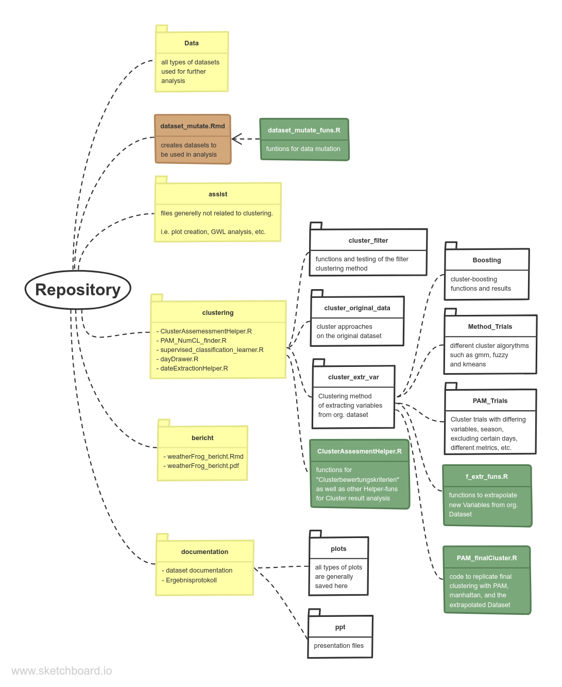

# weatherFrog
## LMU StatPrakt WS 20/21
### large-scale weather conditions in europe

Date of presentation: 01.03.2021  
Institut: Statistik, LMU Muenchen  
Lecture: Statistisches Praktikum  
Project partner: M.Sc. Maximilian Weigert, M.Sc. Magdalena Mittermeier  
Project advisor: Prof. Dr. Helmut Küchenhoff  
Authors: Anne Gritto, Katja Gutmair, Stella Akouete, Noah Hurmer  

### Abstract

In order to divide days into groups or so-called weather conditions based on their weather data, an exploratory search for unsupervised methods is made. For this purpose, measured data on air pressure at sea level and geopotential heigtht at 500 hPa are available at several locations every day. With this information, various cluster analyzes are carried out, the results are compared and reference is made to an existing classification into large-scale weather conditions according to Hess and Brezowsky (*GWL*). In order to be able to compare cluster results, the criteria silhouette coefficient and timeline-score are presented and discussed, which represent the success of clustering. Two methods are described in more detail here. A method, called the filter approach, deals with the spatial structure of certain areas by implementing an algorithm (*SCAPOI*) in which areas of interest are found through a two-stage clustering per day, in order to compare days on the basis of this. The second approach extracts representative variables from the data set in order to remove the spatial structure of the data, thus facilitating a cluster analysis and being able to assign more influence to certain characteristics. The cluster algorithm *PAM* with the Manhattan metric is then applied. For the latter approach, the characteristics of the resulting clusters are descriptively analyzed and the distribution of the *GWL* over the clusters is examined more closely. Certain differences between the clusters can be determined, but a clear division of the *GWL* into clusters is not.

### Set up

In order to run any analysis code, it is necessary to run *dataset_mutate.Rmd* to create and save the required datasets. Beforehand, create a folder "Data" in the project file and insert the following two raw datasets into it : *"GWL_1900-2010.csv", "data_reanalysis_20201109.rds"*. 
  Reference the *dataset_doc.Rmd* file in the folder *documentation* for information on the created datasets.
 

 
 

### Dependencies

data.table, checkmate, tidyverse, rgeos, gstat, rnaturalearth, rnaturalearthdata, cluster, ggfortify, tsne, parallel, ggmosaic, plyr, factoextra, parallelDist, mlr3, ppclust, fclust, Rtsne, dbscan, KneeArrower, clusterR, grid, gridExtra, e1071, akmedoids, fossil, usedist
