```{r setup, include=FALSE, warning=FALSE, message=FALSE}
knitr::opts_chunk$set(echo = TRUE, fig.pos = "H", out.extra = "")
library(tidyverse)
library(data.table)
library(checkmate)
library(knitr)
library(cluster)
library(kableExtra)
longrun = FALSE # set to TRUE to rerun all code
```

\newpage

```{=tex}
\newcounter{savepage}
\pagenumbering{Roman}
```
```{=tex}
\setcounter{tocdepth}{4}
\renewcommand{\contentsname}{Inhaltsverzeichnis}
\tableofcontents
```
```{=tex}
\renewcommand{\listtablename}{Tabellenverzeichnis}
\listoftables
```
\newpage

```{=tex}
\renewcommand{\listfigurename}{Abbildungsverzeichnis}
\listoffigures
```
\newpage

\section*{Abkürzungen}

```{r Abkürzungen, echo=FALSE}
data.table(
  Ausdruck = c("Großwetterlage", "Clustering Large Applications", "Luftdruck in Pascal auf Meeresspiegelhöhe",
           "Geopotential auf 500 hPa in $m^2/s^2$", "Kovarianzmatrix", "Principle Component Analysis", "Partitioning Around Medoids", "Density-Based Spatial Clustering of Applications with Noise",  "Spatial Clustering around Points of Interest", "Cluster-Wetterlage (aufeinanderfolgende Tage mit demselben Clusterindex)", "Timeline-Score", "GWL Aufteilungswert", "Principle Component (Analysis)"),
  Kurzform = c("GWL", "CLARA", "Mslp", "Geopotential", "$\\mathcal{C}$", "PCA", "PAM", "DBSCAN", "SCAPOI", "CWL", "TLS", "${HB}_{diff}$", "PCA / PC")) %>%
  arrange(Ausdruck) %>%
  kable(booktabs = TRUE, format =  "latex", escape = FALSE) %>%
  kable_styling(latex_options = c("repeat_header", "striped"), full_width = TRUE)
```

\newpage

\setcounter{savepage}{\arabic{page}}

\pagenumbering{arabic}

# Einleitung

Der Klimawandel und seine Auswirkungen sind in den letzten Jahrzenten spürbar geworden. Immer häufiger kommt zu extremen Wetterereignissen wie langanhaltende Hitzewellen, Überschwemmungen  Dürre und (Wald-)Brände. Grund für den Klimawandel ist neben dem natürlichen Treibhauseffekt das menschliche Verhalten. Durch die Viehzucht, Abholzung der Regenwälder, Nutzung und Verbrennung fossiler Ressourcen gelangt vermehrt Kohlenstoffdioxid in die Atmosphäre. Durch die genannten Gründe steigt die durchschnittliche globale Temperatur. Der Klimawandel hat schwerwiegende Folgen für die Menschheit. Dürren führen zu Hungersnot und Wasserknappheit, Hitzewellen sorgen für mehr Tote.
Durch den Klimawandel ändert sich auch die Häufigkeit der auftretenden Großwetterlagen.
Magdalena Mittermeier vom Department für Geografie und Maximilian Weigert vom Statistischen Institut der LMU untersuchen, wie sich das Auftreten verschiedener Großwetterlagen (GWL) unter dem Einfluss des Klimawandels verändert.
Im Rahmen des Statistischen Praktikums wird dieses Projekt unterstützt, indem man beobachtete Wetterdaten auf täglicher Basis in Cluster einteilt.


## Großwetterlagen

Es gibt zwei Kategorien, um die Großwetterlagen zu unterteilen, einmal die objektiven und subjektiven Großwetterlagen. Die uns zur Verfügung gestellte Einteilung in Großwetterlagen beruht auf subjektiven Einteilung, nach dem Katalog nach Hess und Brezowsky, der im Jahr 1952 veröffentlicht wurde. Es wurden 29 Großwetterlagen über Europa und dem Atlantik definiert. Zudem gibt es die Kategorie Unbestimmt (U), die angegeben wurde, wenn sich ein Tag keiner GWL zuordnen ließ (siehe @pik119). Die jeweiligen Tage lassen sich anhand von mehreren Variablen einteilen. Die Einteilung erfolgt nach den Zirkulationsformen in Bodennäheund in mittleren tropesphärischen Niveau. Die Zirkulationsformen sind zyklonal und antizyklonal Die Lage "West zyklonal" kommt am häufigsten vor.

## Fragestellung

.....

# Methodik

## Daten

Seit 1900 wird viermal täglich an 160 Standorten in Europa und Teil (siehe Abb. \ref{fig:locations}) das Geopotential auf 500 hPa in $\frac{m^2}{s^2}$ und der Luftdruck (Mslp) in Pascal auf Meeresspiegelhöhe erhoben. Diese Variablen sind Teil des Reanalyse-Datensatzes ERA-20C, der für die Analysen zur Verfügung steht. Zudem liegen die GWL für jeden Tag im Zeitraum von 1900 bis 2010 vor. Im Rahmen des Statistischen Praktikums wird mit dem Reanalyse-Datensatz geclustert. Die Abbildungen \ref{fig:mslp_ex} und \ref{fig:geopot_ex} visualisieren die Werte des Luftdrucks, bzw. Geopotentials am 01.01.1980 um 0 Uhr über alle 160 Standorte. Abb.\ref{fig:avgDay} visualisiert ebenfalls die Werte des Luftdrucks und Geopotential über die 160 Standorte an einem Tag, hier ist aber der Mittelwert über die 4 Messtage pro Tag genommen.


```{r locations, echo = FALSE, fig.cap="\\label{fig:locations}Verteilung der 160 Messpunkte der Variablen Luftdruck und Geopotential auf der Weltkarte", fig.align="center", out.width="80%"}
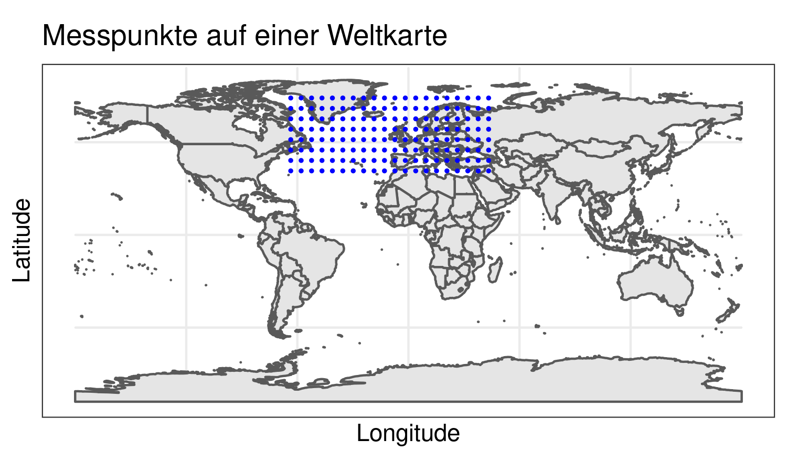
```

```{r mslp_ex, echo = FALSE, fig.cap="\\label{fig:mslp_ex}Messwerte des Mslp an den 160 Messpunkten am 01.01.1980 um 0Uhr über 160 Standorte", fig.align="center", out.width="80%"}
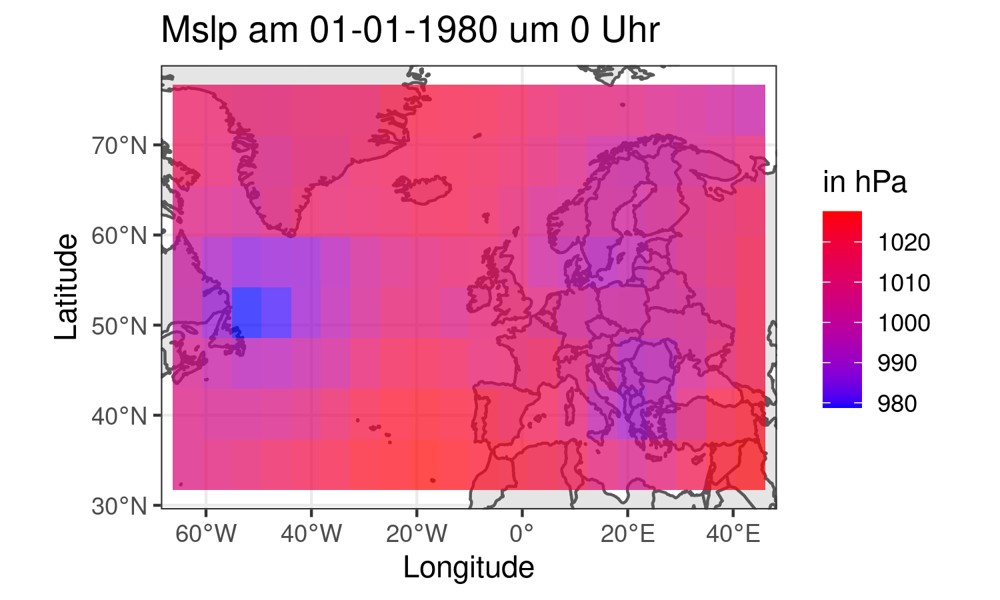
```

```{r geopot_ex, echo = FALSE, fig.cap="\\label{fig:geopot_ex}Messwerte des Geopotentials an den 160 Messpunkten am 01.01.1980 um 0Uhr über 160 Standorte", fig.align="center", out.width="80%"}
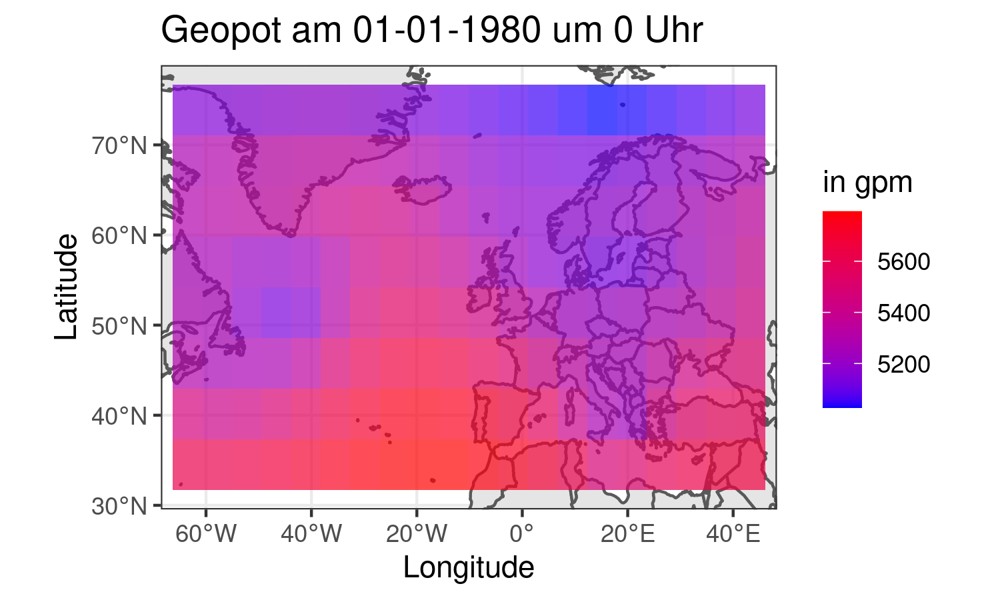
```

\textcolor{red}{insert limitation to 30 years and average}

```{r avgDay, echo = FALSE, fig.cap="\\label{fig:avgDay}Über den Tag gemittelte Messwerte des Geopotentials an den 160 Messpunkten am 01.01.1980. Hierbei wurde bei den Variablen Luftdruck und Geopotential das arithmetrische Mittel über die vier Tageszeitpunkte (0 Uhr, 6 Uhr, 12 Uhr, 18 Uhr) gebildet", fig.align="center", out.width="100%"}
include_graphics("assets/avgDay.png")
```

\textcolor{red}{wie sehen die Daten aus?}

## Clusterbewertungskriterien

Um den Erfolg einer Clusterlösung bewerten zu können und somit verschiedene Clusteransätze vergleichen zu können, mussten vorerst Bewertungskriterien etabliert werden. Hierbei soll zum einen beantwortet werden, ob grundsätzlich das Clustering erfolgreich ein Muster erkennt aber zugleich beachtet werden, ob dieses Muster gemäß der Daten auch sinnvoll ist. Repräsentierend für das erste Kriterium wurde der *Silhouettenkoeffizient* betrachtet, für letzteres die Verteilung der Anzahl von aufeinanderfolgenden Tagen jeweils im selben Cluster, das im Folgenden *Timeline* genannt wird.

### Silhouettenkoeffizient

Der Silhouettenkoeffizient ist eine Maßzahl für die Qualität eines Clusterings. Außerdem ist dieser unabhängig von der Anzahl der Cluster, weshalb der Silhouettenkoeffizient auch zum Festlegen der Clusteranzahl bei folgenden Analysen verwendet wird.

Der Silhouettenkoeffizient ist definiert als die Summe von Silhouetten. Gehört eine Beobachtung $o$ zum Cluster $A$, so ist die Silhouette von $o$ definiert als

$$
S(o) = 
\begin{cases}
  0,                                                              &\text{ wenn }x \text{ einziges Element von }A\\
  \frac{dist(B, o) - dist(A, o)}{max\{dist(B, o),\ dist(A, o)\}}, &\text{ sonst}
\end{cases}
$$

wobei $dist(A, o) :=$ durchschnittliche Distanz zu allen anderen Objekten desselben Clusters und $dist(B, o) :=$ durchschnittliche Distanz zu allen anderen Objekten des nächstgelegenen Clusters ist. Der Silhouettenkoeffizient $s$ ist dann definiert durch die durchschnittliche Silhouettenwerte von allen $n$ Beobachtungen $o$ in einem Datensatz $D$, also

$$
s = \frac{1}{n} \sum_{o \in D}{S(o)} \text{,    mit } -1 \le S(o) \le 1
$$

Sowohl die Silhouetten der Beobachtungen als auch der Silhouettenkoeffizient selber können zwischen -1 und 1 liegen. Ist die Silhouette für ein Objekt $o$ nahe der eins, so bedeutet das inhaltlich, dass die Distanz zu dem nächstgelegendem Cluster, dem $o$ nicht zugehört, deutlich größer ist, als die Distanz zu seinem eigenen Cluster. Ist $S(o)$ negativ, so wäre die Beobachtung eher dem anderen Cluster zuzuordnen (@silhouette).

### Timeline

Da die zeitliche Struktur der Daten, nämlich das Aufeinanderfolgen der Tage in spezifischer Reihenfolge, bei der weiteren Analyse nicht mitbeachtet wird, lässt sich hiermit die Sinnhaftigkeit einer Clustereinteilung gut bewerten. Eine Aufteilung, bei der keine zeitliche Struktur erkennbar ist, beispielsweise ein konstanter Wechsel der Clusterzugehörigkeit in aufeinanderfolgenden Tagen, ist hier nicht als sinnvoll zu betrachten. Gleichermaßen unerwünscht ist jedoch eine Aufteilung die sehr lange Intervalle von Tagen gleicher Clusterzugehörigkeit aufweist. Die am längsten anhaltende GWL nach Hess und Brezowsky in der hier zu untersuchenden Zeitperiode beträgt 23 Tage. Allgemein zeigen Großwetterlagen jedoch kürzere Längen auf.

```{r timeline_GWL, echo = FALSE, fig.cap="\\label{fig:timeline_GWL}Timeline der GWL 1971-2000. Die Anzahl der GWL wurde mit deren Länge multipliziert, sodass jeder Tag eine Beobachtung darstellt", fig.align="center", out.width="80%"}
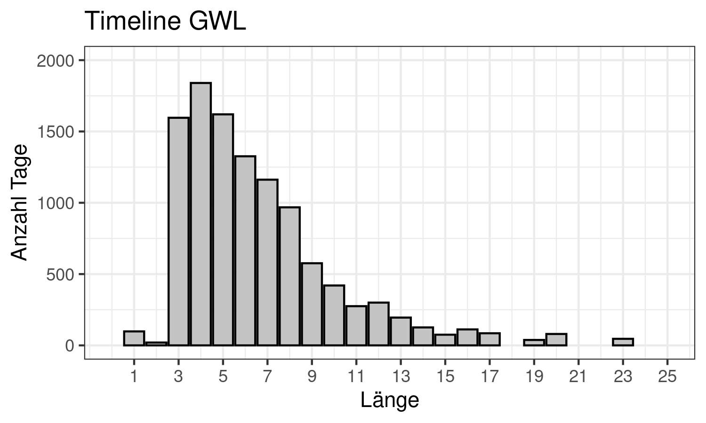
```

Bei der Darstellung in Abbildung \ref{fig:timeline_GWL} ist die Anzahl der GWL jeweils mit der Länge dessen multipliziert, sodass jeder Tag eine Beobachtung in der Darstellung ergibt. Die GWL, die hier nur eine Länge von 1 oder 2 Tagen aufweisen, sind jeweils als *U* (Undefiniert/Übergang) definiert. Es ist zu erkennen, dass die meisten Tage sich in Großwetterlagen der Längen zwischen 3 und 8 Tagen befinden, längere Großwetterlagen immer seltener werden und ab einer Länge von 15 Tagen nur noch einige wenige zu beobachten sind. Anhand dieser Erkenntnisse werden nun Anforderungen an die Timeline der Clusterergebnisse gestellt.

Folglich sollen Cluster-Wetterlagen (*CWL*) auch eine Mindestlänge von 3 Tagen besitzen, also Längen von 1 oder 2 Tagen sind bestenfalls nicht zu beobachten. Gleichermaßen sollen CWL nicht zu lang werden. Da in der Zeitperiode 1971-2000 die maximal beobachtete Länge einer GWL 23 Tage beträgt, die Clusterzahl aber geringer als die Anzahl der GWL (29) sein soll, wird hier festgelegt, dass optimalerweise CWL nicht länger als 40 Tage zu beobachten sind. Darüber hinaus sollen CWL eher mit den Längen 3 bis 12 Tagen auftreten. Diese Optimierungsannahmen wurden hier allein in Bezug auf den Vergleich der GWL Timeline getroffen.

Um die Timeline einer Clusterlösung quantifizierbar und vergleichbar zu gestalten, wird der Timeline eine Verteilung unterlegt (Abbildung \ref{fig:timeline_vtlg}). Der *Timeline-Score* (TLS) ergibt sich dann aus der Summe der punktweisen Abweichungen der Timeline der Clusterlösung zur optimalen Timeline Verteilung.

```{r timeline_vtlg, echo = FALSE, fig.cap="\\label{fig:timeline_vtlg}Erwünschte Verteilung der Timeline einer Clusterlösung", fig.align="center", out.width="80%"}
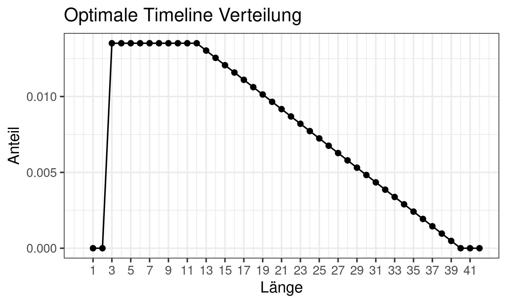
```

$$
  TLS(X) =  1 - \sum_{i = 1}^{l}{|\frac{x_i}{N} - w_i|}
$$ $$
  wobei: X = (x_1, ..., x_l) = \text{Anzahl Tage der jeweiligen CWL-Länge}
$$ $$
  N = \text{Anzahl Tage gesamt}
$$ $$
  W = (w_1, ..., w_{l}) = \text{Ausprägungen der optimalen Timeline Verteilung}
$$

### Vergleich zur GWL-Aufteilung

Die Aufteilung der GWL nach Hess und Brezowsky über die Cluster wird im Folgenden nicht benutzt um Modelle zu bewerten bzw. zu vergleichen, da in der Analyse allgemein auf die Information der Herrschenden GWL verzichtet werden soll. Allerdings wird hier eine Möglichkeit präsentiert, diese Aufteilung zu messen, um dies später in der Ergebnisanalyse zu nutzen. Dafür wird für jede GWL der größte Anteil innerhalb eines Clusters aufsummiert und durch 29 geteilt, um die Maßzahl (im Folgenden: $HB_{diff}$) nach oben auf 1 zu beschränken. Die GWL-Kategorie *U* wird dabei ausgeschlossen. Somit liegt diese Maßzahl bei 1, falls alle GWL sich jeweils nur in einem Cluster befinden.

$$
  HB_{diff} = \frac{1}{29} * \sum_{i = 1}^{29}{\gamma}
$$ $$
  wobei: \gamma = \text{größter Anteil der GWL innerhalb eines Clusters}
$$ $$
  = \frac{1}{n_i}max_{k \in K}\left(\sum_{t=1}^{n_i}{\mathbf{I}_{k}(Tag_t)}\right)
$$ $$
  mit: K = \text{Menge der Cluster; } n_i = \text{Anzahl Tage in der GWL } i
$$

## Cluster Prinzip

Die Grundidee des Clustern ist, Objekte so in Gruppen aufzuteilen, dass Beobachtungen innerhalb der Cluster möglichst homogen und die Gruppen untereinander möglichst heterogen sind. Um ein Clustering durchzuführen wird zum einen ein Distanzmaß benötigt, das die Distanzen zwischen Beobachtungen in einem Datensatz angibt. Zum anderen muss ein Clusteralgorithmus verwendet werden, der resultierende Cluster aus dem Datensatz ausgibt. Sowohl Distanzmaß als auch der Algorithmus können selber implementiert werden. Allerdings gibt es auch schon viele verschiedene Metriken und Algorithmen, die für eine Clusteranalyse geeignet sind.

**Distanzmaß** Ein Distanzmaß gibt die Distanz von allen Beobachtungen eines Datensatzes untereinander an. Es ist somit metrisch und ein Distanzmaß für die Menge an Beobachtungen $\Omega = \{o_1, ... , o_n\}$ bildet auf die reellen Zahlen ab $d : \Omega \text{ } \mathsf{x} \text{ } \Omega \to \mathbb{R}, \text{ mit } d := \text{ Distanzmaß }$. Die Distanz zwischen zwei Beobachtungen $a_i$ und $a_l$ wird also geschrieben als $d(a_i, a_l)$. Für metrische Distanzmaße postuliert man nach Folien Annika Hoyer \textcolor{red}{wie zitiert man Folien?}

$$
\begin{aligned}
& d(o_i, o_l) = d(o_l, o_i)\\
& d(o_i, o_i) = 0\\
& d(o_i, o_l) \ge 0 \text{  } \forall i,l\\
& d(o_i, o_l) \le d(o_i, o_r) + d(o_r, o_l).
\end{aligned}
$$

**Clusteralgorithmus** Es gibt verschiedene Ansätze zu clustern. In diesem Projekt werden Partitionierende Verfahren und Dichtebasiertes Clustering betrachtet. Partitionierende Verfahren, oder auch Optimal Partitionen, messen die Qualität von Partitionen $C$ anhand eines Gütekriteriums. Gesucht sind dabei die Partitionen, die hinsichtlich des Gütekriteriums optimal sind, nämlich $H(C_{opt}) =\displaystyle \min_C H(C)$. Allerdings können dabei nicht alle zulässigen Partitionen betrachtet werden, da die Dimesionen dabei zu groß werden. Daher arbeitet ein Algorithmus mit numerischen Lösungsansätzen durch Austauschverfahren. Das bedeutet aber auch, dass die ausgegebene Lösung nicht die bestmögliche sein muss, sondern eventuell nur ein lokales Optimum. s. Hoyer Folien. Der K-Means oder K-Medoid Algorithmus sind bekannte Beispiele für die Partitionierenden Verfahren.

Dichtebasiertes Clustern...


## Filter Ansatz

### Motivation


Beim genaueren Blick in die Beschreibungen einzelner GWL ist zu erkennen, dass diese häufig duch Position oder Form bestimmter Gebiete mit erkennbar höheren oder tieferen Messwerten definiert sind.

Beispielsweise wird die GWL Trog Westeuropa (TRW) definiert durch ein sich vertikal erstreckendes Tiefdruckgebiet von Skandinavien bis zur Iberischen Halbinsel, flankiert von Hochdruckgebieten über dem Atlantik und Westrussland. Hingegen die GWL Hoch Britische Inseln (HB) ist, wie der Name bereits vermuten lässt, beschrieben durch ein Hochdruckgebiet über dem Vereinigten Königreich und Irland, umgeben von mehreren Tiefdruckgebieten @sklima. Ähnlich ist dies bei allen weiteren Großwetterlagen zu beobachten.

Demnach lässt sich vermuten, dass die GWL sich anhand der Position und Form, der an dem Tag respektiven Hoch- und Tief(druck)gebiete, sinnvoll gruppieren ließen.

### Prinzip Filtern

Diesen Grundgedanken verfolgend, sind die Tage optimalerweise in interessierende Gebiete zu unterteilen und anhand der Positionen und Formen dieser Gebiete miteinander zu vergleichen. "Interessierende Gebiete" wurden hierbei vorerst angenommen als die Gebiete um die täglich gemessenen Extrema. Folglich also einem Gebiet höherer Messwerte um den am Tag maximal gemessenen Wert und einem Gebiet tieferer Messwerte um den minimalen Messwert. Dabei ist zu beachten, dass diese Gebiete nicht zu groß werden aber auch nicht nur aus einzelnen wenigen Punkten bestehen. Außerdem sollte ihre Form nicht durch den Clusteralgorithmus bestimmt bzw. beeinflusst werden, da die Gebiete sonst alle ähnliche Formen aufweisen würden, und nicht treu repräsentiert werden würden. Beides führte später zu Problemen bei dem Vergleich zwischen den Tagen. Alle Standorte die nicht in den interessanten Gebieten liegen sollten beim Vergleich der Tage nicht mit einbezogen werden, demnach bei der Gebietseinteilung als Rauschen bezeichnet werden.

Um diese Gebietseinteilung eines Tages durchzuführen, soll also ein metrischer Messwert eines bestimmten Standortes mit einer Gebietszugehörigkeit ersetzt werden. Die Messinformationen des Tagen sollen also "gefiltert" werden. Da sonst bestimmte Hyperparameter oder Grenzwerte fest angegeben werden müssten, lässt sich dies durch ein seperates Clusterverfahren über die 160 Standorte pro Tag erreichen. Mit der Idee anhand beider Parameter-Messwerte (Mslp und Geopotential) "Gebiete-Muster" zu erkennen und, da durch Experimentieren herausgefunden wurde, dass die beiden Parameter vereinigt keine besonders sauberen Muster zu erkennen ließen, wird jeder Tag zwei mal auf diese Weise geclustered; jeweils pro Parameter ein Mal. Die Feature-Variablen dieses Clusterverfahrens sind demnach Longitude, Latitude und der Parametermesswert.

### DBSCAN und Fuzzy

Um der Anforderung der nicht uniformen Gebiete gerecht zu werden, erscheint ein dichtebasiertes Clusterverfahren von Vorteil. Ein implementiertes Verfahren, das auch die Möglichkeit des Rauschens beinhaltet, ist *DBSCAN* (Density-Based Spatial Clustering of Applications with Noise). Ein solches Verfahren nutzt einen sog. Nachbarschaftsparameter, um Beobachtungen zueinander als Nachbarn einzuteilen oder eben nicht. Demnach liegt hier nicht ein Mittelpunkt eines Clusters vor, zu dem der Abstand einer jeweiligen Beobachtung entscheidend dafür ist, ob sie sich jeweils in diesem Cluster befindet, sondern Beobachtungen innerhalb eines Clusters weisen jeweils geringe Distanzen zu ihren Nachbarpunkten im selben Cluster auf. Dadurch werden Cluster erstellt, die sehr unförmig sein können. @tds.dbscan

*DBSCAN* benötigt keine Angabe der Clusteranzahl, sondern nur der Hyperparameter *minPoints* (minimale Anzahl an Punkte pro Cluster) und *eps* (Nachbarschaftsparameter). Hier lässt sich erhoffen, dass eventuell auch mehr als nur die zwei Gebiete um die Extrema erkannt werden. Allerdings musste schnell erkannt werden, dass sich der Algorithmus mit diesen Daten sehr sensitiv gegenüber den Hyperparametern präsentiert, selbst wenn der Nachbarschaftsparameter pro Tag anhand dem Wert der größten Wölbung eines $k$NN-plots ($k$ = minPoints) spezifisch berechnet wird (siehe Absatz [SCAPOI]). Dies führt dazu, dass sehr viele Tage nur zu Noise, einem einzigen Cluster oder zu riesigen Clustern gefiltert werden; was widerrum nicht erwünscht ist, da die Vergleichbarkeit der Tage im Nachhinein damit nahezu unmöglich wird.

Ein Bestimmen der Startpunkte und somit ein Festsetzen der Cluster-Orte ist - zumindest in vorhandenen Implementationen dieses Algorythmus' - nicht möglich. Deswegen lässt sich beobachten, dass die Extrema oft nicht in einem der eingeteilten Clustern befinden, da sie sich oft stark von durchschnittlichen Messwerten abweichen. *DBSCAN* führt somit im besten Fall zu Gebieten, dessen Messpunkte sich eher im Mittelfeld der Skala des Tages befinden und innerhalb der Gebiete kaum Veränderungen aufweisen. Solche Gebiete sind aber hier as nicht von besonderem Interesse vermutet und deshalb wird *DBSCAN* hierfür ausgeschlossen.


 

Ein weiterer vielversprechender Ansatz ist das *Fuzzy*-Clustering. *Fuzzy* entpricht vom Prinzip k-Means, es werden also pro Cluster Mittelpunkte festgelegt. Allerdings wird für jede Beobachtung eine Zugehörigkeitswahrscheinlichkeit für jedes Cluster berechnet, anstatt einer Cluster-Id. Hier können Startpunkte angegeben werden und anhand der Clusterzugehörigkeitswahrscheinlichkeit jeder Beobachtung, bestimmte Beobachtungen mithilfe eines Schwellenwertes im Nachhinein zu Rauschen verwandelt werden.

Allerdings ist dieses Verfahren hier auch nicht optimal, da, neben dem, dass *Fuzzy* üblicherweise rechentechnisch sehr teuer implementiert ist, kommt hinzu, dass dieses Verfahren auf einen Mittelpunkt pro Cluster beruht und die Distanz dazu anhand eines gegebenen Distanzmaß' bestimmt wird. Nachdem die Koordinaten als Variablen aufgenommen werden, führt dies zu Clustern gleicher Form und verletzt somit die Anforderung die Form eines Gebietes möglichst getreu darzustellen.


### SCAPOI

Im Folgenden wird der benutzte Algorithmus beschrieben, der eine abgeänderte Version des *DBSCAN* darstellt. Dieser beinhaltet fixe Startpunkte und ein iterierend strenger werdendes Nachbarschaftskriterium. Er wird im folgenden immer als *SCAPOI* (Spatial Clustering around Points of Interest) benannt.

 

```{=tex}
\begin{algorithm}[H]
 \KwData{Messwerte eines Parameters der 160 Standorte am Tag}
 \KwResult{Gebietszugehörigkeitsvektor pro Tag}
 \;
 eps0 = Berechnete Distanz des Punktes der größten Krümmung in Bezug auf kNN\;
 Startpunkte = Orte des gemessenen Minimums und Maximums\;
 \For{jeden Startpunkt}{
    eps = eps0\;
    beginne ein Cluster um den Startpunkt\;
    \While{Neue Punkte gefunden werden, die hinzugefügt werden}{
    Prüfe ob es Punkte gibt, die < eps von einem im Cluster existierenden Punkt entfernt sind\;
    \eIf{ein Punkt bereits einem anderen Cluster angehört}{
     Füge es dem Cluster hinzu, dessen Startpunkt es am nächsten liegt\;
     }{
     füge es dem Cluster hinzu\;
    }
    eps = reduzierter eps\;
   }
 }
 nicht zugeteilte Punkte bleiben Noise\;
 \caption{SCAPOI - Algorythmus}
\end{algorithm}
```
 

Die Startpunkte werden hier jeweils als die Extrema der Messpunkte gewählt. Der Nachbarschaftsparameter *eps* muss groß genug gewählt (bzw. berechnet) werden, um zu berücksichtigen, dass die Extrema im Vergleich zu anderen Messwerten stark abweichen und somit zu verhinderen, dass die Cluster gar nicht oder zu gering wachsen. Allerdings führt aber zu großer eps dann zu einem zu starken Wachsen der Cluster, da der Abstand eines Messpunktes zu seinem Nachbar selten größer ist, als der Abstand der Extrema zu seinen Nachbarn. Deshalb wird dieser Nachbarschaftsparameter *eps* pro Iteration verkleinert.

Der Nachbarschaftsparameter wird hier für jede Tag-Parameter Kombination berechnet, indem der Punkt der größten Wölbung eines kNN-Distanzplot berechnet wird. Dieser visualisiert die Distanzen von Beobachtungen zu seinen $k$ Nachbarn. $k$ wird hier als 10 festgesetzt, mit dem Ziel, am Ende Gebiete der Mindestgröße 10 zu erhalten.

```{r kNN_dist, echo = FALSE, fig.cap="\\label{fig:kNN_dist}10-NN Distanz mit Punkt der maximalen Wölbung", fig.align="center", out.width="80%"}
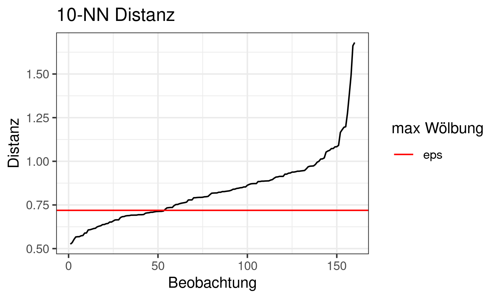
```


Eine Verkleinerung des Nachbarschaftsparameters pro Iteration findet hier in linearer Form statt, da dies, rein visuell bewertet, die repräsentativsten Gebiete als Ergebnis liefert.


$$
  eps_{t+1} = eps_t -  \frac{(t-1)eps_t}{6}   
$$ $$
  wobei: t = \text{Iterationsindex}
$$

Im Vergleich zu *DBSCAN*, mit dem Gruppierungen von Beobachtungen gesucht werden, die einer bestimmten mindest-Dichte, sowie einer mindest-Größe gerecht werden, wird mit *SCAPOI* versucht um bestimmte, definierte Beobachtungen Gruppen zu bilden, die eine gewisse Dichte aufweisen. Im Fall hier (2 Cluster um min und max respektive), erhält man nun einen Gebietszugehörigkeitsvektor mit den Klassen: Noise, High und Low.

```{r scapoi_res, echo = FALSE, fig.cap="\\label{fig:scapoi_res}Beispiel der Gebietszuteilung eines Tages durch SCAPOI", fig.align="center", out.width="100%"}
include_graphics("assets/filterRes.png")
```


### Distanzmetrik

Um nun wieder auf Tagesebene clustern zu können, sprich mit den Tagen als Beobachtungseinheit Cluster zu bilden, benötigt man eine Metrik, mit der diese Gebietszugehörigkeitsvektoren zweier Tage mieinander verglichen werden können. Der *Rand-Index* präsentiert eine solche Möglichkeit. Dieser vergleicht jeweils, ob pro Clusterlösung Paare zweier Beobachtungen jeweils im selben Cluster liegen. Obwohl dies eher gedacht ist, um Lösungen verschiedener Clusterverfahren mit denselben Beobachtungen zu vergleichen, ist der *Rand-Index* hier möglich, da die Messpunkte konstant sind. Allerdings ist dabei irrelevant, in welchem Cluster sich das Paar jeweils befindet, was in diesem Fall nicht erwünscht ist: Zwei Tage mit identischen Gebietsformen und -orten aber gespiegelter Zugehörigkeit sollen nicht eine Distanz von 0 zueinander aufweisen. Zu dem sind natürlich Messpunkte, die als Noise definiert wurden, nicht von Interesse und sollten demnach auch nicht mit einbezogen werden.

Deshalb wurde folgend eine Distanzmetrik definiert, die über zwei Tage alle Messpunkte, die jeweils als Noise definiert wurden, nicht betrachtet und mit den verbleibenden vergleicht, welche Gebietszugehörigkeit die Messpunkte jeweils aufweisen. Danach wird noch durch die größte Anzahl an Messpunkten nicht in Noise dieser zwei Tagen geteilt, um den Wertebereich auf [0,1] zu beschränken, sowie einer möglichen Ausprägung der Gebiete als Teilmengen voneinander ebenfalls nicht eine Distanz von 0 zuzuweisen.

$$
  d(A, B) = 1 - \left( \frac{\sum_{i = 1}^{160}{\mathbf{I}(a_i = b_i \neq 0)}}{max_{x  \in {A, B} } \left( \sum_{i = 1}^{160}{\mathbf{I}(x_i \neq 0)}\right)} \right)
$$ $$
  wobei: A = (a_1, ..., a_{160}) ; B =  (b_1, ..., b_{160})
$$ $$
  und: \forall_{x \in {A, B}} : x \in \{0 \text(Noise), 1 \text(Hoch), 2 \text(Tief)\}
$$


## Clustern mit extrahierten Daten

Ein weiterer Ansatz ist, dass Informationen aus dem Reanalyse Datensatz extrahiert werden und diese dann Variablen eines neuen Datensatzes werden. Die Grundidee beruht auf der naiven Annahme, dass Großwetterlagen zum einen über bestimmte Messwerte am Tag und zum anderen über die Lage dieser Werte charakterisiert werden. Die GWL TM (Tief Mitteleuropa) zeichnet sich beispielsweise durch ein Tief über Mitteleuropa aus (@tm). Daher sind zwei Kategorien von Interesse, die Verteilung der Messwerte der Parameter, Mslp und Geopotential, pro Tag und deren räumliche Lage. 

Es wird von dieser Methodik erhofft, dass die Dimensionen weiter reduziert werden können und dass wichtige Größen spezifisch gewichtet werden können.

### Extrahieren der Variablen

Die Ausgangslage beim Extrahieren der Variablen ist dabei größtenteils der Datensatz mit 320 Dimensionen, also der, bei dem die vier Messzeitpunkte für jeden Tag gemittelt wurden. Davon werden verschiedene Größen extrahiert, die jeweils eine interessante Variable über alle Standorte zusammengefasst verkörpert, wie zum Beispiel der Mittelwert des Luftdrucks über alle Standorte pro Tag. Dieser ist damit unabhängig von den Standorten und gehört zu der Kategorie "Verteilung der Parameter" am Tag. Weitere Variablen dieser Kategorie sind das Minimum und Maximum, der Median, die 0.25- und 0.75-Quantile, die Intensität und die Veränderung über den Tag jeweils für beide Parameter Luftdruck und Geopotential.

Für das Minimum, Maximum, Median, Mittelwert und die beiden Quartile wird je ein Tag mit den 160 Standorten betrachtet, wovon diese Variablen für den Luftdruck sowie für das Geopotential extrahiert werden.

Die Intensität wird in "Intensität Hoch" und "Intensität Tief" aufgeteilt und ist die Anzahl der Messwerte am Tag, die unter bzw. über dem 0.25- bzw. 0.75-Quantil, über alle Tage zusammen betrachtet, liegen. Sind beispielsweise an einem Tag 10 Messwerte des Geopotentials unterhalb des 0.25-Quantils über alle Tage betrachtet, so ist die Variable "Intensität Tief Geopotential" für diesen Tag 10. Die Intention dahinter ist, dadurch zum einen, die Größe von Hoch- und Tiefgebiete am Tag zu bestimmen. Hochgebiete sind hier einfachhalber durch hohen Luftdruck und hohes Geopotential definiert, wobei diese Parameter getrennt voneinander betrachtet werden und analog für ein Tiefgebiet. 
Das bedeutet, insgesamt gibt es 4 Variablen, die die Intensität beschreiben - Intensität Hoch und Intensität Tief je für Mslp und Geopotential. Dadurch lassen sich die Tief- und Hochgebiete am Tag miteinander vergleichen. Zum anderen kann die Größe und Intensität der Gebiete über alle Tage verglichen werden, da sie in Bezug auf die Quartile über alle Tage gebildet werden. So kann es zum Beispiel sein, dass an einem Tag die Intensität des Luftdrucks für ein Hochgebiet 0 ist, da an diesem Tag generell niedrige Mslp Werte beobachtet wurden.

In Abschnitt 2.1 wurde bereits beschrieben, dass der Mittelwert über vier Messzeitpunkte pro Tag gebildet wurde. Da dies mit einem Informationsverlust einhergeht, wird die Variable "Veränderung über den Tag" eingeführt. Sie ist definiert als die summierten, absoluten Differenzen des maximalen und minimalen Messwertes für jeden Standort am Tag. Diese Variable wird folglich mit Hilfe des Originaldatensatzes, ohne Informationsverlust, für beide Parameter Mslp und Luftdruck extrahiert.

Da bereits Variablen extrahiert wurden, die die Verteilung der Parameter an verschiedenen Tagen beschreiben, ist des Weiteren noch die räumliche Ebene von Interesse. Dafür wird das 8x20 Grid in 9 Quadranten unterteilt, also in Nord - Süd, Ost - West und jeweils die Mitte bzw. das Zentrum, wie man in Abbildung \ref{fig:quadranten} sehen kann.

```{r quadranten, echo = FALSE, fig.cap="\\label{fig:quadranten}Aufteilung der 160 Standorte in 9 Quadranten", fig.align="center", out.width="80%"}
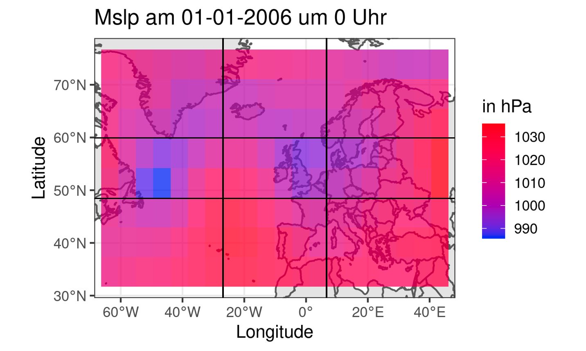
```

Es wird für jeden Tag angegeben, in welchem der 9 Quadranten sich die Extremwerte, also Minimum sowie Maximum für je Luftdruck und Geopotential, befinden. Ursprünglich waren diese Variablen kategorial, da die Quadranten von eins bis neun durch nummeriert wurden, z.B.

$Quadrant_{maxMslp, i} \in \{1, 2, ... , 9\} \ mit \ i = 1, ... , 10958\ (Anzahl\ der\ Tage)$. Allerdings ist der Datensatz dadurch sowohl mit numerischen, als auch mit kategorialen Variablen und die Möglichkeiten zu clustern sind damit eingeschränkt. Deshalb wurden zwei "Dummy-Variablen" eingeführt, sodass die Lage auch numerisch angegeben werden kann. Diese Variablen sind Spalte und Zeile für die vier Extremwerte am Tag, beispielsweise $Zeile_{maxMslp, i} \in \{1, 2, 3\}\ \text{und}\\ Spalte_{maxMslp, i} \in \{1, 2, 3\}\  \text{mit}\ i = 1, ... , 10958$. 

Zudem werden die Distanzen zwischen Extrempunkten mit einbezogen. Zum einen die Distanzen zwischen dem Maximum und Minimum für je Geopotential und Luftdruck. Zum anderen die Distanzen vom Minimum bzw. Maximum des Geopotential zu den jeweiligen Extremwerten des Luftdrucks für jeden Tag. Alle Distanzen werden mit der euklidischen Distanz gebildet, wobei die Longituden und Latituden der Extremwerte am Tag zur Berechnung betrachtet werden.

Zuletzt werden bei der räumlichen Ebene für beide Parameter die Mittelwerte in allen 9 Quadranten angegeben werden. Das sind somit 18 weitere Variablen.

Insgesamt umfasst der neu extrahierte Datensatz 48 Variablen. Die Variablen wurden in Absprache mit dem Projektpartner definiert und in Tabelle \ref{tab:variablen} sind die extrahierten Variablen für je das Geopotential sowie den Luftdruck zusammengefasst.

```{r variablen, echo=FALSE}
dt <- data.table(
  Variable = c("Minimum", "Maximum", "Mittelwert", "Median", "Quartile", "Intensität Hoch", "Intensität Tief", 
               "Veränderung über den Tag", "Spalte Minimum", "Zeile Minimum", "Spalte Maximum", "Zeile Maximum",
               "Distanz zwischen Extrema", "Distanz der beiden Minima", "Distanz der beiden Maxima", 
               "Mittelwerte in den Quadranten"),
  Definition = c("Minimaler Wert pro Tag", "Maximaler Wert pro Tag", "Mittelwert pro Tag", "Median pro Tag", 
                 "Quartile pro Tag", 
                 "Anzahl der Messpunkte am Tag, die über alle Daten über dem 0.75-Quantil liegen", 
                 "Anzahl der Messpunkte am Tag, die über alle Daten unter dem 0.25-Quantil liegen", 
                 "Summierte Differenzen von vier Messzeitpunkten am Tag für alle Standorte",
                 "Spalte $x_{min}$, in dem sich Minimum befindet; $x_{min} = 1, 2, 3$",
                 "Zeile $y_{min}$, in dem sich Minimum befindet; $y_{min} = 1, 2, 3$",
                 "Spalte $x_{max}$, in dem sich Maximum befindet; $x_{max} = 1, 2, 3$",
                 "Spalte $y_{max}$, in dem sich Maximum befindet; $y_{max} = 1, 2, 3$",
                 "Euklidische Distanz zwischen Minimum und Maximum",
                 "Euklidische Distanz vom Minimum Geopotential zu Minimum Mslp",
                 "Euklidische Distanz vom Maximum Geopotential zu Maximum Mslp",
                 "Mittelwerte in jeweils 9 Quadranten"))
kbl(dt, caption = "Extrahierte Variablen", booktabs = TRUE, format =  "latex", escape = FALSE, label = "variablen",)  %>%
  kable_styling(latex_options = "striped", full_width = FALSE) %>%
  pack_rows("Verteilungsvariablen", 1, 8) %>%
  pack_rows("Räumliche Ebene", 9, 16) %>%
  column_spec(2, width = "25em")
```

### Distanzmetrik

Cluster können gefunden werden, indem die Distanzen von allen Beobachtungen in einem Datensatz miteinander verglichen werden. \textcolor{red}{finde Quelle}. Dafür muss ein Distanz- oder Ähnlichkeitsmaß festgelegt werden oder neu implementiert werden. Die Wahl für diese Clusteranalyse fiel auf die Manhattan-Distanz, die für zwei Beobachtungen *a* und *b* definiert ist als

$$
d(a, b) = \sum_{i = 1}^{p} |a_{i} - b_{i}|
$$

$$
wobei\ a = (a_{1}, ... , a_{p})\ und\ b = (b_{1}, ... , b_{p})\ mit\ p = 48\ (Anzahl\ der\ Variablen)
$$

Die Manhattan Distanz wird in Abbildung \ref{fig:manhattan} für einen zweidimensionalen Fall, also $p = 2$, beispielhaft veranschaulicht.

```{r manhattan, echo = FALSE, warning = FALSE, fig.align="center", out.width="80%", fig.cap="\\label{fig:manhattan}Beispiel für die Manhattan-Distanz im zweidimensionalen Raum"}
data_manhat <- data.frame(x = c(1, 3), y = c(1, 2))
ggplot(data_manhat, aes(x, y)) + 
  geom_point(size = 3, stroke = 2, shape = 4) + 
  geom_segment(aes(x = 1, y = 1, xend = 3, yend = 1), color = "darkgreen", size = 1.2) +
  geom_segment(aes(x = 3, y = 1, xend = 3, yend = 2), color = "darkblue", size = 1.2) +
  scale_x_continuous(breaks = c(0, 1, 2, 3, 4), limits = c(0, 4)) +
  scale_y_continuous(breaks = 0:3, limits = c(0,3)) +
  theme_classic() +
  geom_text(label = expression(italic("d(a, b) = |1 - 3| + |1 - 2| = 3")), x = 1, y = 2.5, size = 5)+
  geom_text(label = "a = (1, 1)", x = 1, y = 0.75) +
  geom_text(label = "b = (3, 2)", x = 3, y = 2.25) +
  geom_text(label = "|1 - 3|", x = 2, y = 0.85) +
  geom_text(label = "|1 - 2|", x = 3.1, y = 1.5, angle = 90) +
  labs(title = "Manhattan-Distanz im zweidimensionalen Raum")

```

Weitere Distanzmetriken, die ausprobiert wurden, sind unter anderem die Euklidische Distanz und die Gower Distanz, die aber beide zu schlechteren Ergebnissen, gemessen anhand der definierten Bewertungskriterien, geführt haben. In Abschnitt 2.5 werden diese weiteren Versuche grob dargestellt.

#### Skalierung

Die Variablen haben verschiedene Skalen. Werte des Luftdrucks liegen beispielsweise immer zwischen ungefähr $935 \text{ und } 1065\ hPa$ und die des Geopotentials ca. zwischen 45300 und 58700 $gpm$. Außerdem gibt es auch Variablen, wie zum Beispiel die Zeilen oder Spalten die nur Werte von eins, zwei oder drei aufweisen. Der Abstand von verschiedenen Variablen kann somit sehr groß sein und da zum Berechnen einer Distanzmatrix diese Werte betrachtet werden, muss der Datensatz vor dem Clustering skaliert werden. Die Skalierung erfolgt hier durch eine Standardisierung, d.h. $x_{i,neu} = \frac{x_{i} - \mu_{i}}{\sigma_{i}}\ mit\ i = 1, ... , 48$. Dabei wird für jede Beobachtung einer Variable i der Erwartungswert dieser Variablen abgezogen und schließlich durch die Standardabweichung der Variable dividiert. Dies wird für alle im Datensatz enthaltenen, also 48 Variablen durchgeführt. 

#### Gewichtung

Des Weiteren soll der extrahierte Datensatz gewichtet werden. Das bedeutet, es wird fachlich entschieden, wie wichtig bestimmte Variablen sind. Da die Gewichtung Einfluss auf das Bilden einer Distanzmatrix hat, sollen Variablen, die von besonderem Interesse sind, höher gewichtet werden, sodass dies bei der Distanzmetrik berücksichtigt werden kann.

Dafür werden die Variablen zuerst in verschiedene Kategorien aufgeteilt. Die Kategorien sollen alle insgesamt das gleiche Gewicht haben. Hier wurden 8 Kategorien gewählt: Die Verteilungsvariablen Minimum, Maximum und Mittelwert ergeben je eine Kategorie für das Geopotential und den Luftdruck. Die restlichen Verteilungsvariablen, Median, Quartile, Intensität und Veränderung über den Tag sind 2 weitere Kategorien. Die fünfte und sechste Kategorie setzen sich aus den räumlichen Variablen Zeile, Spalte, Distanzen zwischen Extrema zusammen und die Mittelwerte in den Quadranten bilden die letzten zwei. Die Kategorien summieren sich jeweils auf eins und die Variablen werden innerhalb einer Kategorie gleich gewichtet.

In Tabelle \ref{tab:Gewichtung} sieht man die Kategorien mit ihren Variablen und Gewichten.

```{r Gewichtung, echo=FALSE, fig.cap="\\label{tab:Gewichtung}Gewichte für Variablen. Each row represents a list element"}
dt2 <- data.frame(
  
  Variable = c("Minimum, Maximum, Mittelwert", "Minimum, Maximum, Mittelwert", "Median, Quartile, Intensität Hoch, Intensität Tief, Veränderung über den Tag", "Median, Quartile, Intensität Hoch, Intensität Tief, Veränderung über den Tag","Spalte und Zeile für Minimum/Maximum, Distanz zwischen Extrema, Distanz der beiden Minima/Maxima", "Spalte und Zeile für Minimum/Maximum, Distanz zwischen Extrema, Distanz der beiden Minima/Maxima", "Mittelwerte in den 9 Quadranten", "Mittelwerte in den 9 Quadranten"),
  Gewichte = c("$1/3$", "$1/3$", "$1/3$", "$1/6$", "$\\frac{1}{6}$", "1/6", "1/9", "1/9")  
  ) 

kbl(dt2, booktabs = TRUE, format =  "latex", escape = FALSE, label = "Gewichtung", caption = "Gewichte für Variablen", align = "l") %>%
  kable_styling(latex_options = "striped", full_width = FALSE)%>%
  pack_rows("1  Verteilungsvariablen Mslp I", 1, 1) %>%
  pack_rows("2  Verteilungsvariablen Geopotential I", 2, 2) %>%
  pack_rows("3  Verteilungsvariablen Mslp II", 3, 3) %>%
  pack_rows("4  Verteilungsvariablen Geopotential II", 4, 4) %>%
  pack_rows("5  Räumliche Ebene für Mslp", 5, 5) %>%
  pack_rows("6  Räumliche Ebene für Geopotential", 6,6) %>%
  pack_rows("7  Mittelwerte in  den Quadranten für Mslp", 7, 7) %>%
  pack_rows("8  Mittelwerte in den Quadranten für Geopotential", 8, 8) %>%
  column_spec(1, width = "29em") %>%
  column_spec(2, width = "2cm") %>%
  add_indent(positions = c(2, 3, 4, 6, 8), level_of_indent = 0.3, all_cols = TRUE)
```

### Clusterverfahren

Um eine Clusteranalyse durchzuführen, gibt es viele verschiedene Methodiken bzw. Algorithmen. Hier ist die Wahl auf den Clusteralgorithmus PAM (Partitioning Around Medoids) gefallen, der 1990 von Kaufman und Rousseeuw eingeführt wurde. Dabei werden die Beobachtungen in $k$ disjunkte Partitionen aufgeteilt. Dieser wird auch "k-medoid" Algorithmus genannt, weil die Beobachtung, die am zentralsten innerhalb eines Clusters liegt, das Zentrum dieses Clusters ist und somit repräsentativ für andere Beobachtungen desselben Clusters ist. Da hier eine reale Beobachtung repräsentativ für ein Cluster ist, ist nach @kmedoid dieses Verfahren robuster als beispielsweise ein k-means Algorithmus, bei dem der Mittelwert von allen Punkten eines Cluster repräsentativ für dieses ist (@multivariate). Ein weiterer Grund für PAM ist, dass der implementierte Algorithmus pam() in R aus dem Package "cluster" sehr vielfältig ist. Er akzeptiert als Input sowohl direkt eine Distanzmatrix als auch einen Dataframe mit Daten.

#### Partitioning Around Medoids

Bei PAM wird angegeben, wie viele Cluster $k$ gebildet werden sollen. Der Algorithmus sucht dann anfänglich $k$ repräsentative Beobachtungen, die das Zentrum der entstandenen Cluster darstellen, um danach iterativ bessere Repräsentanten zu finden. Alle möglichen Kombinationen von repräsentativen und nicht-repräsentativen Beobachtungen werden analysiert und die Qualität der jeweiligen Clusterings wird anhand eines Gütekriteriums evaluiert. Dieses Gütekriterium ist hier die Summe $S$ der Distanzen von allen Datenpunkten zu deren jeweiligen Medoids. Anhand dieses Gütekriteriums werden die nicht-repräsentativen Datenpunkte dem Cluster zugefügt, das die Summe $S$ am stärksten minimiert. Dann werden zufällig ein weiterer Datenpunkt gewählt und es werden die Kosten $C$ berechnet, die entstehen, wenn man diesen mit den repräsentativen Punkten tauschen würde. Dabei sind die Kosten definiert als die Veränderung des Gütekriteriums $S$, wenn die ein repräsentativer Punkt mit einem anderen Datenpunkt getauscht wird. Das bedeutet, die Kosten können sowohl negativ als auch positiv sein. Sind sie negativ, so wird die Summe $S$ der Distanzen von allen Datenpunkten zu deren Medoids kleiner und die Punkte werden vertauscht @kmedoid2. \textcolor{red}{nochmal genauer abchecken + stopp kriterium}

Der Algorithmus wird hier nach @kmedoid2 als Pseudocode dargestellt.

 

```{=tex}
\begin{algorithm}[H]
 \KwData{Datensatz $D$ mit $n$ Beobachtungen $o$}
 \KwResult{Set mit $k$ Clustern}
 Suche zufällig $k$ Punkte aus $D$ als erste repräsentative Objekte\;
 \While{Stop-Kriterium nicht erreicht wurde}{
  \For{jeden weiteren Datenpunkt $o$ in $D$}{
    Finde den am nächsten liegenden repräsentativen Datenpunkt und teile $o$ diesem Cluster zu
    }
    Wähle zufällig einen nicht-repräsentativen Punkt $o_{rand}$\;
    Berechne die Kosten $C$ für einen möglichen Tausch von $o_{rand}$ und einem repräsentativen Datenpunkt $o_{i}$\;
    \If{$C < 0$}{
    Tausche $o_{i}$ mit $o_{rand}$ und forme ein neues Set mit $k$ repräsentativen Punkten
    }
 }
 Gebe das Cluster Ergebnis aus\;
 \caption{PAM Pseudocode}
\end{algorithm}
```
 

#### Wahl der Clusteranzahl

Die Wahl der Clusteranzahl $k$ muss vor dem Ausführen des Algorithmus statt finden. Aber um die optimale Anzahl an Clustern zu finden, wird der Silhouettenkoeffizient für verschiedene $k$ betrachtet. Der Silhouettenkoeffizient ist wie in Abschnitt 2.2.1 beschrieben, unabhägig von der Clusteranzahl. Daher kann er für die Wahl der Clusteranzahl heran gezogen werden. In Abbildung \ref{fig:numclust} sieht man die Silhouettenkoeffizienten für $k = \{5, 6, 7, 8, 9\}$. Den größten Wert bekommt man mit einer Clusteranzahl $k = 6$. Somit wird das resultierende Clusterergebnis mit dem Algorithmus PAM, der Distanzmetrik Manhattan und 6 Clustern gebildet.

```{r numclust, echo = FALSE, fig.cap="\\label{fig:numclust}Optimale Anzahl an Cluster. Die Clusteranzahl mit dem maximalen Silhouettenkoeffizient ist die optimale Clusteranzahl, hier $k = 6$.", fig.align="center", out.width="80%"}
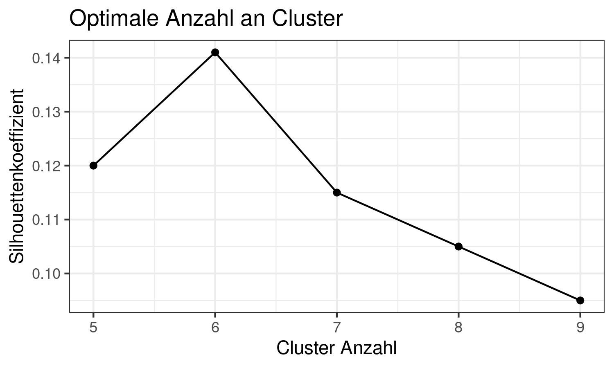
```

## Weitere Versuche

Das endgültige Ergebnis wurde mit der Distanzmetrik Manhattan und dem Clusteralgorithmus PAM anhand des extrahierten Datensatzes erzielt. Da es aber viele Clustermöglichkeiten gibt, wurden anfangs verschiedene Methodiken ausprobiert und anhand der definierten Bewertungskriterien bewertet. Dabei wurden zuerst die Daten von fünf Jahren verwendet, da 30 Jahren rechentechnisch sehr aufwendig waren. Die Methoden, die am besten abschnitten, wurden dann anhand von 30 Jahren beurteilt. Im Folgenden werden weitere Versuche kurz dargestellt und zusammengefasst.

### CLARA, K-Means und PAM mit Originaldaten

Bevor die Variablen extrahiert wurden, gab es auch Clusteranalysen mit dem Reanalyse-Datensatz, bei dem für beide Parameter die vier Beobachtungen am Tag jeweils gemittelt wurden, also der Datensatz mit 320 Dimensionen für die Jahre 2006 bis 2010.

**CLARA** 

Zum einen wurde ein Clustering mit dem Algorithmus Clustering Large Applications (CLARA) durchgeführt. Dafür wurde die Funktion clara() aus dem Package "cluster" in R verwendet. Dieser basiert auf dem K-Medoids-Ansatz, ist aber speziell für Datensätze, die sehr viele Beobachtungen enthalten, z.B. mehrere Tausend Objekte. Dieser Algorithmus wird von @clara eingeführt und erklärt. 

Dieser Algorithmus wurde mit der Manhattan-Distanz, als auch mit der Euklidischen Distanz ausprobiert. Für eine Clusteranzahl von fünf für CLARA mit Manhattan als Distanzmaß, beträgt der Silhouettenkoeffizient $s = 0.1302$, der Timeline-Wert $TLS = 0.1670$ und der Wert für die Aufteilung der GWL in den Clustern $HB_{diff} = 0.4919$.

Führt man die Clusteranalyse mit CLARA, der Euklidischen Distanz und $k = 6$ Clustern durch, so erhält man für den Silhouettenkoeffizient einen Wert von $s = 0.1239$, der Timeline-Wert beträgt $TLS = 0.1764$ und $HB_{diff} = 0.4882$.

**K-means** 

K-means ist ein bekannter Algorithmus für Clusteranalyse und teilt die Beobachtungen in $k$ disjunkte Cluster. Jedes Cluster wird dabei von einem Centroid repräsentiert, das im Gegensatz zu PAM nicht eine echte Beobachtung ist, sondern der Mittelwerten von allen Objekten im gleichen Cluster. Der K-means Algorithmus wird von @kmeans genauer beschrieben. Für dieses Projekt wurde die Funktion kmeans() aus dem Package "stats" herangezogen. Mit dieser wurde für die Originaldaten ein Clustering durchgeführt. Der Silhouettenkoeffizient beträgt dabei $s = 0.1286$, der Timeline-Wert ist $TLS = 0.2433$ und die Maßzahl für die Güte der Aufteilung der GWL in den Clustern $HB_{diff} = 0.5167$. 

**PAM mit Mahalanobis-Distanz**

Da beim Clustering der Originaldaten nicht beachtet wird, dass es Korrelationen zwischen den Variablen gibt, wurde die Mahalanobis-Distanz in Betracht gezogen. Diese beachtet bei der Berechnung der Distanzen die Korrelation zwischen den verschiedenen Variablen. Korrelationen gibt es in dem Datensatz vor allem zwischen den Parametern Luftdruck und Geopotential sowie dem Standort. Es lässt sich intuitiv vermuten, dass wenn z.B. an einem bestimmten Standpunkt hoher Luftdruck vorliegt, dass der Luftdruck des nebenliegenden Standorts wahrscheinlich auch eher hoch ist. 

Für p-dimensionale Daten $x = (x_1, x_2, ... , x_p)^T$ mit einem Vektor mit Mittelwerten      $\mu = (\mu_1, \mu_2, ... , \mu_p)^T$ und Kovarianzmatrix $\sum$ ist die Mahalanobis-Distanz generell definiert als $D_M(x) = \sqrt{(x - \mu)^T\ \sum^{-1}\ (x - \mu)}$. 

Ist $\sum$ die Einheitsmatrix, so entspricht die Mahalanobis-Distanz der Euklidischen Distanz (@mahalanobis).

Mit der resultierenden Distanzmatrix wurde dann eine Clusteranalyse mit PAM durchgeführt für $k = 6$. Der Silhouettenkoeffizient liegt dabei bei $-0.0014$ und ist somit zum ersten Mal negativ. Auch der Timeline-Wert liegt unter 0 mit $TLS = -0.6657$. Der Wert für die Güte der Aufteilung der GWL in den Clustern $HB_{diff} = 0.4127$.

**PCA**

Mit Hilfe einer *Principle Component Analysis* (PCA) lassen sich die Dimensionen eines Datensatzes effektiv reduzieren. Hierbei wird versucht die Variablen durch Linearkombinationen zu ersetzen, die jeweils bestmöglichst die Varianz der Beobachtungen beschreiben. Dadurch wird erreicht, dass ein Großteil der Varianz durch eine bestimmte Anzahl der ersten *Principle Components* erklärt werden kann, folglich eine Dimensionsreduktion mit minimalen Informationsverlust. @pca

```{r pca, echo = FALSE, fig.cap="\\label{fig:pca}Visualisierung der Clusterlösung mittels Principal Component Analysis.", fig.align="center", out.width="80%"}
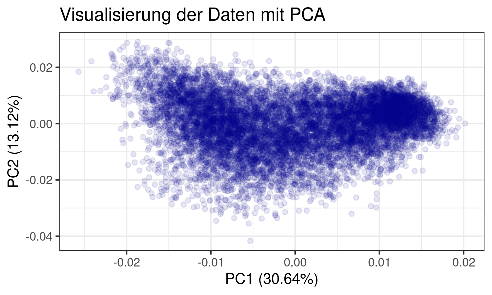
```

In Abbildung \ref{fig:pca} sind die ersten beiden *PC* dieses Datensatz abgebildet und es ist zu beobachten, dass diese ca. 44% der Varianz erklären können. Eine auffällige Aufteilung der Beobachtungen in Gruppen ist hier allerdings nicht zu beobachten.

Ein Ansatz \textcolor{red}{reference} ist hier, mit der Anzahl an *PC* weiter zu clustern, die mindestens \textcolor{red}{85}% der Varianz der Daten erklären. Hier ergibt sich dies zu \textcolor{red}{12}. Eine Analyse mit $k$*-means* ($k$ = \textcolor{red}{6}) ergab einen Silouettenkoeffizient von \textcolor{red}{0.1566} und ein *TLS* von \textcolor{red}{0.1373}.

\textcolor{red}{HBdiff von 0.4042}


### PAM, K-Means und Fuzzy mit Extrahierten Daten


```{r Clusterversuche, echo=FALSE, fig.cap="\\label{tab:Versuche}Clusterversuche. Each row represents a list element"}
dt3 <- data.table(
  Algorithmus = c("CLARA", "CLARA", "PAM", "K-Means", "PAM", "PAM", "PAM", "PAM", "K-Means"),
  Metrik = c("Euklidisch", "Manhattan", "Mahalanobis", "PCA", "Gower", "Euklidisch", "Manhattan", "Mahalanobis", "Euklidisch")
)

kbl(dt3, booktabs = TRUE, format =  "latex", escape = FALSE, label = "Gewichtung", caption = "Versuche von verschiedenen Methoden für 5 Jahre") %>%
  kable_styling(latex_options = "striped", full_width = FALSE)%>%
  pack_rows("Reanalyse-Datensatz", 1, 4) %>%
  pack_rows("Datensatz mit Extrahierten Variablen", 5, 9)
  
  
```

```{r Clusterentscheidung, echo=FALSE, fig.cap="\\label{tab:Entscheidung}Clusterentscheidung. Each row represents a list element"}
dt3 <- data.table(
  Metrik = c("Manhattan"),
  Variablen = c("48 + 3 PCA Komponenten")
)
  
  
```

# Ergebnisse

Dieser Abschnitt beinhaltet die Ergebnisse verschiedner Clusterlösungen. Abschnitt 3.1 beinhaltet die Ergebnisse des Filteransatzes und Abschnitt 3.2 beinhaltet die Ergebnisse der Clusterversuche mit den extrahierten Variablen. Abschnitt 3.3 beinhaltet die Ergebnisse und deskriptive Analyse der finalen Clusterlösung.

## Filter Ergebnisse

  

\textcolor{red}{insert results seperated and unified}

## Ergebnisse extrahierte Variablen

In diesem Abschnitt werden die Ergebnisse des Clusterings mit den extrahierten Variablen dargelegt. Die Optimale Clusteranzahl lag hier bei $k = 6$. 

In Abbildung \ref{fig:silhouette} ist der Silhouettenplot der resultierenden Cluster zu sehen. Auf der x-Achse sind hier alle Beobachtungen, aufgeteilt nach Cluster und innerhalb der Cluster nach abnehmender Silhouette geordnet, abgebildet. Der Silhouettenkoeffizient beträgt $s = 0.141$. Es lässt sich erkennen, dass Cluster 6 die meisten Beobachtungen aufweist. Außerdem beinhaltet es kaum Beobachtungen, die eine negative Silhouette aufweisen. Der höchste Silhouettenwert lässt zudem in CLuster 6 finden. Cluster 3 enthält wohl die wenigsten Beobachtungen. Es fällt zudem auf, dass Cluster 5 die kleinste Silhouette beinhaltet, mit $S(o) < -0.25$.

```{r f_sil, echo = FALSE, fig.cap="\\label{fig:silhouette}Silhouettenplot für Clusterergebnis mit extrahierten Variablen mit $k = 6$", fig.align="center", out.width="80%"}
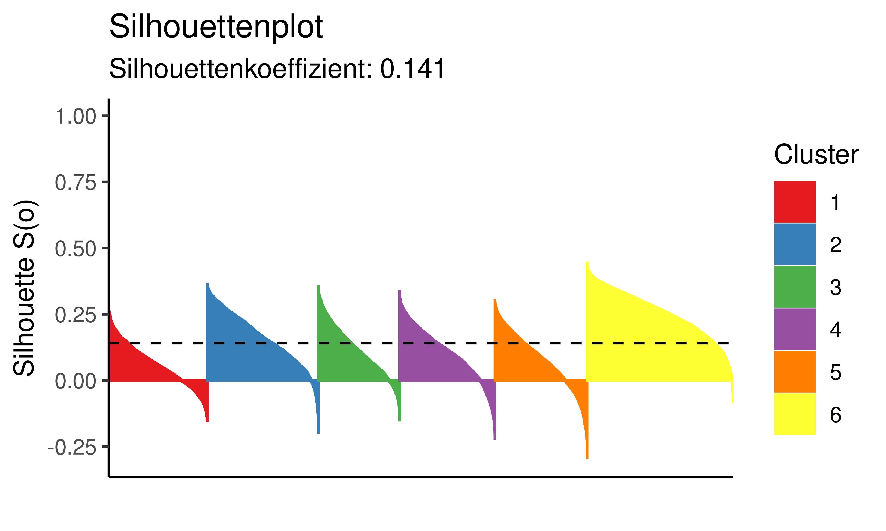
```

Abbildung \ref{fig:tlMultiplied} zeigt den Timeline-Plot für dieses Clustergebnis. Es lässt sich erkennen, dass die meisten Tage in aufeinanderfolgenden Clustern der Länge 1 bis 13 sind. In Bezug auf die Timeline der GWL ist dies auch erwünscht, mit Ausnahme der Längen 1 und 2. Einzelne Tage kommen in den Jahren 1971 - 2000 ungefähr 600 Mal vor. Am häufigsten lassen sich aufeinanderfolgende Cluster der Länge 3 beobachten, mit ca. 800 Tagen. Längen, die größer als 40 sind, sind eher nicht erwünscht, da die längste GWL in diesen 30 Jahren 23 Tage andauerte. Auch hier sind jenseits der Länge 40 nur wenige Tage zu finden. Die CWL, die am längsten andauert, beträgt 89 Tage. Auffällig ist außerdem, die Länge 61 vier Mal auftritt. Insgesamt gehören also ungefähr 250 Tage zu einer CWL, die 61 Tage anhält.

Der Timeline-Score beträgt $TLS = 0.3357$, ist also der höchste, der bisher in diesen Analysen erreicht wurde.

\textcolor{red}{dis true?}

```{r tlMultiplied, echo = FALSE, fig.cap = "\\label{fig:tlMultiplied}Timeline-Plot für Clusterergebnis mit extrahierten Variablen mit $k = 6$", fig.align="center", out.width = "80%"}
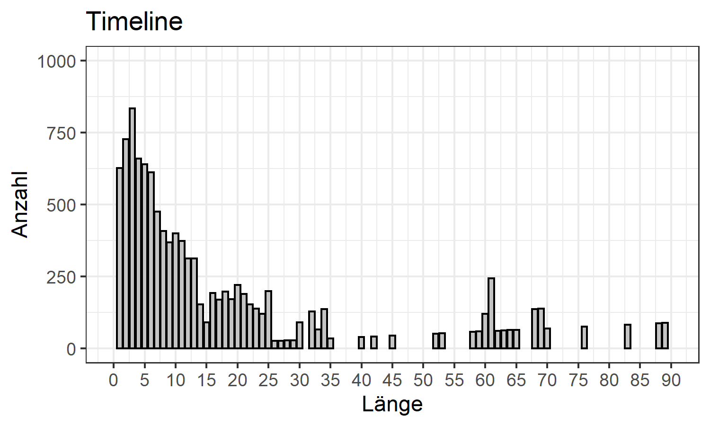
```

Dieser Abschnitt präsentiert die Ergebnisse der deskriptiven Analyse der finalen Clusterlösung. Hierbei wird in Abschnitt 3.3.1 betrachtet, wie die Cluster 1 bis 6 über die Jahre 1971 bis 2010 verteilt sind. Zudem wird das Verhältnis von Sommer- und Wintertagen in den einzelnen Clustern betrachtet. Abschnitt 3.3.2 befasst sich mit den Ähnlichkeiten und Unterschieden der extrahierten 48 Variablen in den Clustern. Abschließend wird in Abschnitt 3.3.3 die Clusterlösung mit der GWL Einteilung nach Hess und Brezowsky verglichen, also in welchem Ausmaß die GWLs über die Cluster verteilt sind.


### Verteilung der Cluster über die Zeit

Abb. \ref{fig:distribution_of_years_over_cluster} stellt dar, wie häufig jedes Cluster im Zeitraum 1971 bis 2000 vorkommt. Zu erkennen ist, dass sich ein Cluster nicht auf eine bestimmte Zeitperiode beschränkt, sondern über den gesamten Zeitraum erstreckt. Zudem ist kein Trend in der Aufteilung der Tage innerhalb eines Clusters auf die Jahre 1971 bis 2000 erkennbar. Die Cluster 4,5 und 6 sind hierbei gleichmäßiger über den Zeitraum von 1971 bis 2000 verteilt als die Cluster 1, 2 und 3. Beispielsweise beinhaltet das Jahr 1985 6% aller Tage, die Cluster 1 zugeordnet sind, das Jahr 1990 beinhaltet hingegen nur 2% aller Tage, die Cluster 1 zugeordnet sind. Damit verglichen sind Cluster 4 bis 6 sehr gleichmäßig über alle Jahre verteilt. In Cluster 4 sticht das Jahr 2000 hervor. In diesem sind 6,3% aller Tage, die Cluster 4 zugeordnet sind, vertreten, während in allen anderen Jahren durchschnittlich je 3% aller Tage, die Cluster 4 zugeordnet sind, vertreten sind. Somit beinhaltet das Jahr 2000 ca. doppelt so viele Cluster 4-Tage verglichen mit den anderen Jahren. Von allen Clustern ist Cluster 6 am gleichmäßigsten über alle Jahre verteilt.

```{r distribution_of_years_over_cluster, echo = FALSE, fig.cap="\\label{fig:distribution_of_years_over_cluste}Aufteilung der Tage auf die Jahre getrennt nach Cluster. Pro Cluster wird dargestellt, welcher relative Anteil aller Tage, die diesem Cluster zugeordnet sind, sich in einem Jahr befinden.", fig.align="center", out.width="80%"}
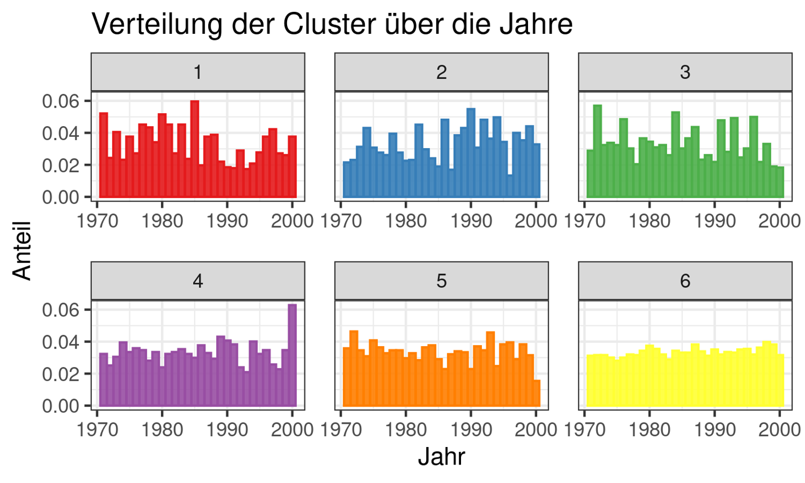
```

### Verhältnis von Sommer- und Wintertagen in den Clustern

Die Werte des Mittelwerts Luftdrucks (Abb. \ref{fig:distribution_season_mslp}) und des Mittelwert des Geopotentials (Abb. \ref{fig:distribution_season_geopot}) sind in der Sommerzeit tendenziell höher als in der Winterzeit. Hierbei sind die saisionalen Unterschiede bei dem Mittelwert des Geopotentials deutlich stärker ausgeprägt als bei dem Mittelwert des Luftdrucks. Diese Aufteilung des Jahres in Sommer- und Winterzeit erfolgt nach Vorlage der Publikation von James P.M. 2006 (@article_james). Um diese saisonalen Unterschiede zu berücksichtigen und die Verteilung der Winter- und Sommertagen in den Clustern zu betrachten, wird das Kalenderjahr in eine Winter- und in eine Sommerzeit aufgeteilt. Alle Tage im Zeitraum 16. Oktober bis 15. April werden als Wintertage definiert, die restlichen Tage folglich als Sommertage (@article_james).


```{r distribution_seasom_mslp, echo = FALSE, fig.cap="\\label{fig:distribution_season_mslp}Darstellung der Verteilung der Variable Mittelwert des Luftdrucks getrennt nach Sommer- und Winterzeit im Zeitraum 1971-2000", fig.align="center", out.width="80%"}
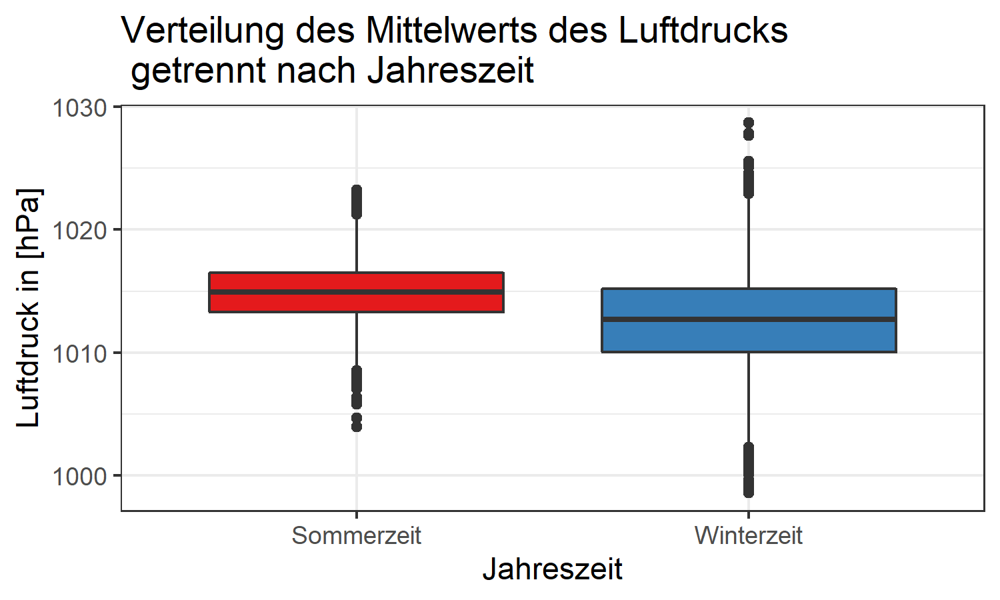
```

```{r distribution_seasom_geopot, echo = FALSE, fig.cap="\\label{fig:distribution_season_geopot}Darstellung der Verteilung der Variable Mittelwert des Luftdrucks getrennt nach Sommer- und Winterzeit im Zeitraum 1971-2000", fig.align="center", out.width="80%"}
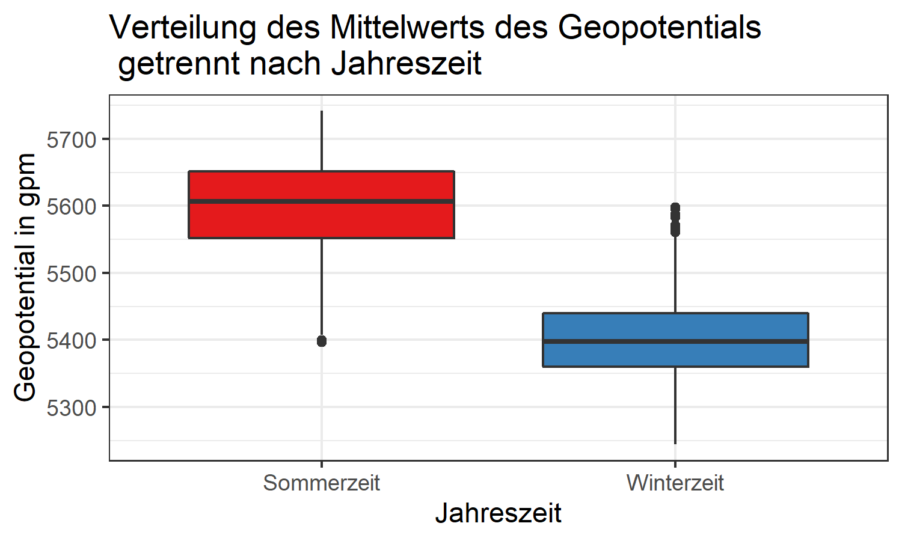
```

Die Graphik in Abb. \ref{fig:mosaic_seasons} visualisiert die relativen Häufigkeiten der Winter- und Sommertage in jedem Cluster. Cluster 1 bis 3 enthalten überwiegend Wintertage; in Cluster 1 sind 88% aller Tage Wintertage, in Cluster 2 99% und in Cluster 3 98% aller Tage Wintertage. In Cluster 4 bis 6 sind hingegen überwiegend Sommertage vertreten; in Cluster 4 sind 79% aller Tage Sommertage und in Cluster 5 83% aller Tage Sommertage. Ein Sonderfall ist Cluster 6, da dieses ausschließlich aus Sommertagen besteht.

```{r mosaic_seasons, echo = FALSE, fig.cap="\\label{fig:mosaic_seasons}Gestapeltes Balkendiagramm, der den relativen Anteil an Winter- und Sommertagen je Cluster abbildet", fig.align="center", out.width="90%"}
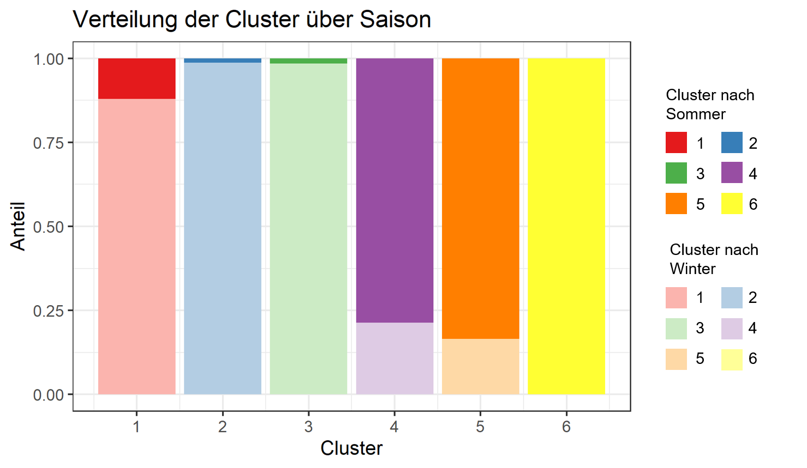
```


### Unterschiede und Ähnlichkeiten in den Clustern

Dieser Abschnitt befasst sich mit der Fragestellung, wie sich die Werte der 48 extrahierten Variablen, mit denen geclustert wurde, zwischen den Clustern unterscheiden. Dazu werden Mittelwerte, Standardabweichung und Verteilungen ausgewählter, repräsentativer Variablen und dessen räumliche Verteilung über die 160 Messorte betrachtet.

Abb. \ref{fig:observation_in_cluster} zeigt die Aufteilung der Tage im Zeitraum 1971 bis 2000 auf die Cluster 1 bis 6. Hierbei bildet Cluster 3 mit einer Anzahl an 1422 Tagen das kleinste Cluster. Cluster 6 beinhaltet die meisten Tage (2565 Tage). Während in Cluster 2 1952 Tage vertreten sind, beinhalten Cluster 1,4 und 5 eine ähnliche Anzahl an Tagen.

```{r observation_in_cluster, echo = FALSE, fig.cap="\\label{fig:observation_in_cluster}Verteilung der Tage im Zeitraum 1971 - 2000 auf die Cluster 1 bis 6", fig.align="center", out.width="80%"}
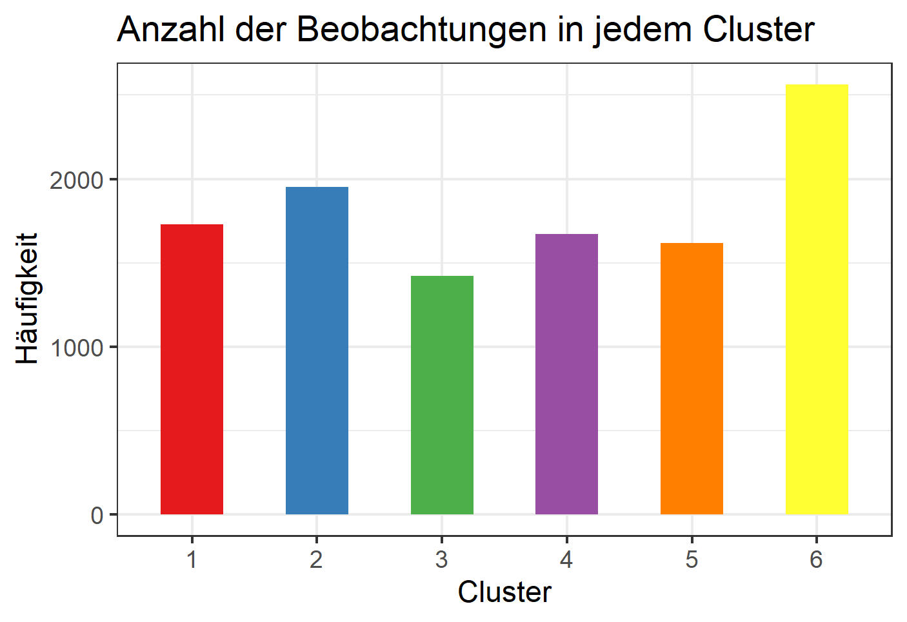
```

Tabelle \ref{fig:descriptive_cluster} bildet Mittelwert und Standardabweichung der Variablen Mittelwert, Maximum und Minimum des Luftdrucks und Mittelwert, Maximum und Minimum des Geopotentials in jedem Cluster ab. Hierbei unterschieden sich die Werte einer Variablen in jedem Cluster nur gering voneinander. Zum Beispiel beträgt die maximale Abweichung der Variable Mittelwert des Luftdrucks in allen Clustern nur 8,2 hPa und die maximale Abweichung der Variable Mittelwert des Geopotentials 287,7 gpm.

```{r descriptive_cluster, echo = FALSE, fig.cap="\\label{fig:descriptive_cluster}Mittelwert und Standardabweichung ausgewählter Variablen pro Cluster. Alle Werte, die den Luftdruck betreffen, sind in der Einheit hPa, alle Werte, die das Geopotential betreffen, sind in der Einheit gpm ", fig.align="center", out.width="100%"}

```

Abb. \ref{fig:mean_mslp_boxplot} und Abb. \ref{fig:mean_geopot_boxplot} bilden die Verteilung der Variablen Mittelwert des Luftdrucks und Mittelwert des Geopotentials je Cluster ab. Verglichen mit der Variable Mittelwert des Geopotentials unterschiedet sich der Median und die Verteilung der Variable Mittelwert des Luftdrucks in jedem Cluster wenig. Hierbei beinhaltet Cluster 2 mit einem Median von 1009,5 hPa und einem Interquartilsabstand(IQR) von 3,8 hPa (1. Quartil = 1007,4 3.Quartil = 1011,2 hPa) tendenziell die kleinsten Werte auf, während Cluster 5 mit einem Median von 1017 hPa und einem Interquartilsabstand von 3 hPa (1.Quartil = 1016 hPa, 3. Quartil = 1019 hPa) tendenziell die höchsten Werte aufweist. Bei der Variable Mittelwert des Geopotentials weisen die Werte der Cluster 4 bis 6 deutlich höhere Werte auf als die Werte in den Clustern 1 bis 3. Wie bei der Variable Mittelwert des Luftdrucks beinhaltet auch das Cluster 2 bei der Variable Mittelwert des Luftdrucks tendenziell die niedrigsten Werte mit einem Median von 5360 gpm und einem IQR von 58 gpm (1.Quartil = 5334 gpm, 3. Quartil = 5392 gpm). Cluster 6 weist tendenziell die höchsten Werte mit einem Median von 5654 gpm und einem IQR von 42 gpm (1.Quartil = 5632 gpm , 3. Quartil = 5674 gpm). Die Variable Mittelwert des Geopotentials weist mehr Ausreißer auf als die Variable Mittelwert des Luftdrucks.

```{r mean_mslp_boxplot, echo = FALSE, fig.cap="\\label{fig:mean_mslp_boxplot}Verteilung der Variable Mittelwert des Luftdrucks in jedem Cluster", fig.align="center", out.width="80%"}
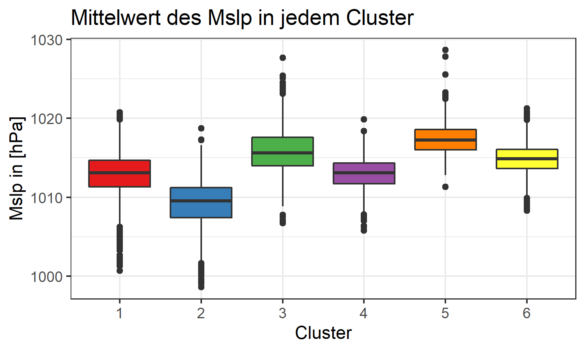
```

```{r mean_geopot_boxplot, echo = FALSE, fig.cap="\\label{fig:mean_geopot_boxplot}Verteilung der Variable Mittelwert des Geopotentials in jedem Cluster", fig.align="center", out.width="80%"}
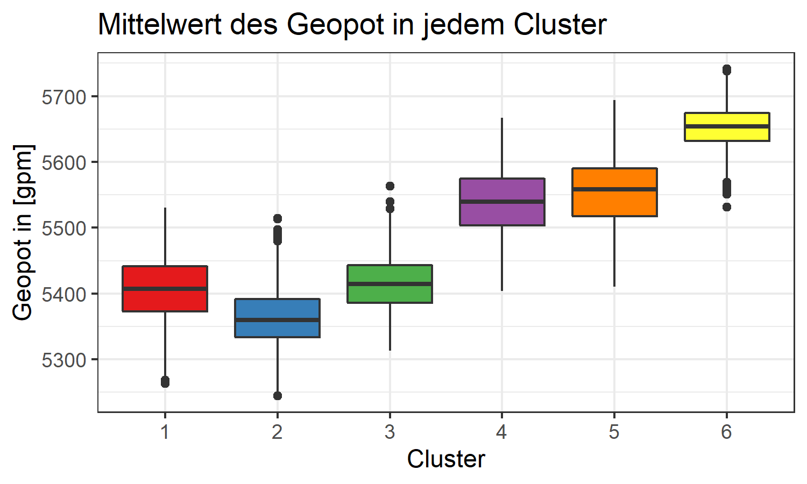
```

Alle anderen extrahierten Variablen, die in die Clusteranalyse miteingegangen sind und die die Verteilung beschreiben, ähneln den beschriebenen Ergebnissen von Mittelwert des Luftdrucks und Mittelwert des Geopotentials hinsichtlich der Verteilung der Werte in und zwischen den Cluster.

Nun wird betrachtet, wie sich der Mittelwert des Luftdrucks und der Mittelwert des Geopotentials räumlich unterscheidet. Abb \ref{fig:mslp_measurepoints} bzw. Abb.\ref{fig:geopot_measurepoints} stellt pro Cluster und für jeden der insgesamt 160 Standorte das arithmetrische Mittel des Luftdrucks bzw. des Geopotentials im Zeitraums 1971 -- 2000 dar. Blaue Flächen visualisieren Gebiete mit niedrigeren, rote Flächen visualisieren Gebiete mit höheren Werten.

```{r mslp_measurepoints, echo = FALSE, fig.cap="\\label{fig:mslp_measurepoints}Räumliche Verteilung des Luftdrucks je Cluster. Für jeden der 160 Standorte wurde das arithmetrische Mittel der Variable Geopotential über alle Tage im Zeitraum von 1971-2000 berechnet.", fig.align="center", out.width="100%"}
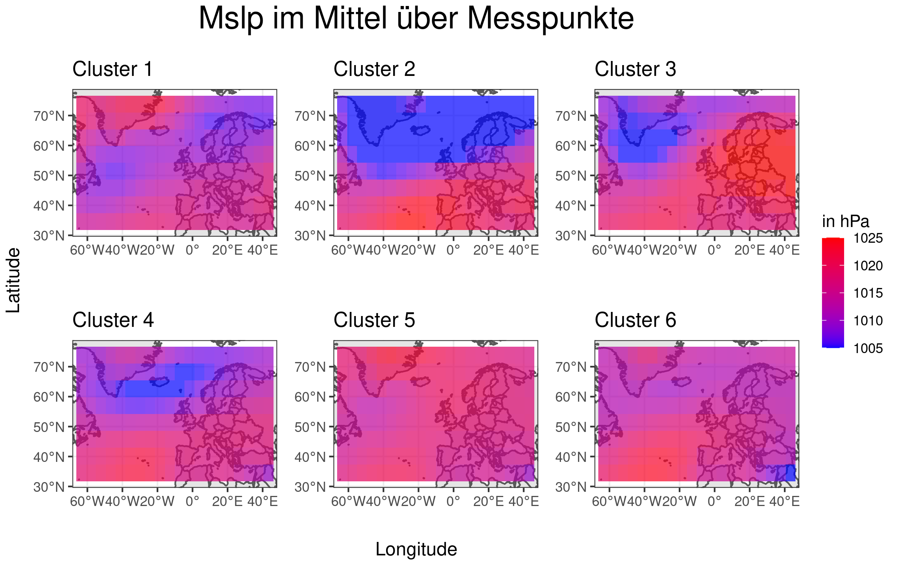
```

```{r geopot_measurepoints, echo = FALSE, fig.cap="\\label{fig:geopot_measurepoints}Räumliche Verteilung des Geopotentials je Cluster. Für jeden der 160 Standorte wurde das arithmetrische Mittel der Variable Geopotential über alle Tage im Zeitraum von 1971-2000 berechnet.", fig.align="center", out.width= "100%"}
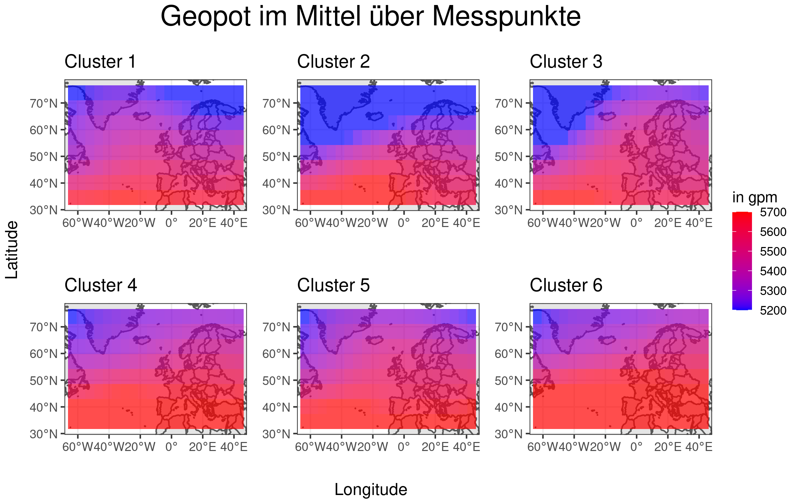
```

Die räumliche Verteilung der gemittelten Werte des Luftdrucks ist pro Cluster unterschiedlich. In Cluster 1 befinden sich nordwestlich sehr hohe Werte während in Cluster 2 ähnlich hohe Werte des Luftdrucks im Süden zu finden sind. Zudem sind dort die hohen Werte über eine größere Fläche verteilt als in Cluster 1. In Cluster 3 ist hingegen das Gebiet mit hohen Luftdruckwerten östlich gelegen, in Cluster 4 und 6 südwestlich. Cluster 5 und 6 sind gekennzeichnet von tendenziell hohen Luftdruckwerten, ein ausgeprägtes Gebiet mit tiefen Luftdruckwerten ist in Cluster 5 nicht enthalten, und in Cluster 6 nur südöstlich. Im Gegensatz dazu befindet sich in Cluster 2 die größte Fläche mit niedrigen Luftdruckwerten, das nördlich gelegen ist. Insgesamt hat jedes Cluster eine eigene, charakteristische Verteilung der Luftdruckwerte.

Bei der räumlichen Verteilung der Werte des Geopotentials aufgeteilt nach Cluster ergibt sich hingegen ein anderes Bild im Vergleich zum Luftdruck. Tendenziell befinden sich in jedem Cluster nördlich, bzw. nordwestlich niedrigere Werte , südlich, bzw. südwestlich sind höhere Werte. In den Clustern 1 bis 3 ist der Unterschied zwischen den niedrigsten und höchsten Werten des Geopotentials stärker ausgeprägt als in den Clustern 4 bis 6.

Das Cluster 6 ist sowohl bei der Varaible Luftdruck als auch bei der Variable Geopotential von höheren Werten geprägt im Vergleich zu den restlichen Clustern. Eine mögliche Erklärung für dieses Phänomen ist, dass Cluster 6 als einziges Cluster ausschließlich Tage der Sommerzeit enthält.

### Vergleich der Clusterlösung mit den GWL


Der Mosaikplot in Abb. \ref{fig:mosaic_GWL} stellt die Aufteilung der GWLs auf die 6 Cluster dar. Zudem wird gezeigt, wie häufig eine bestimmte GWL in den betrachteten Zeitraum von 1971 bis 2000 vorkommt. Im Allgemeinen ist die Anzahl der auftretenden Wetterlagen heterogen. Hierbei ist die Großwetterlage WZ: Westlage zyklonal am häufigsten vertreten, dicht gefolgt von BM: Hochdruckbrücke Mitteleuropa. Selten vertreten sind die GWL NA: Nordlage antizyklonal, SZ: Südlage zyklonal und undefinierte Tage, also Tage, denen keine GWL zugeordnet werden kann. Außer HNFA, NA und NEZ (nicht in Cluster 2), SEZ (nicht in Cluster 6) ist jede GWL in allen Clustern vertreten. Der Großteil der GWLs verteilen sich hierbei gleichmäßig auf die Cluster. Dennoch gibt es auch GWLs, die hauptsächlich in einem Cluster vorherrschen. WZ und HNFA sind zu je 40% in Cluster 2, bzw. in Cluster 5 vertreten. 52% der GWL SEZ befindet sich in Cluster 3 und 43% der GWL WS in Cluster 1.


```{r mosaic_GWL, echo = FALSE, fig.cap="\\label{fig:mosaic_GWL}Mosaikplot, der darstellt, mit welchem Anteil die GWLs auf die Cluster 1 bis 6 aufgeteilt sind", fig.align="center", out.width="100%"}
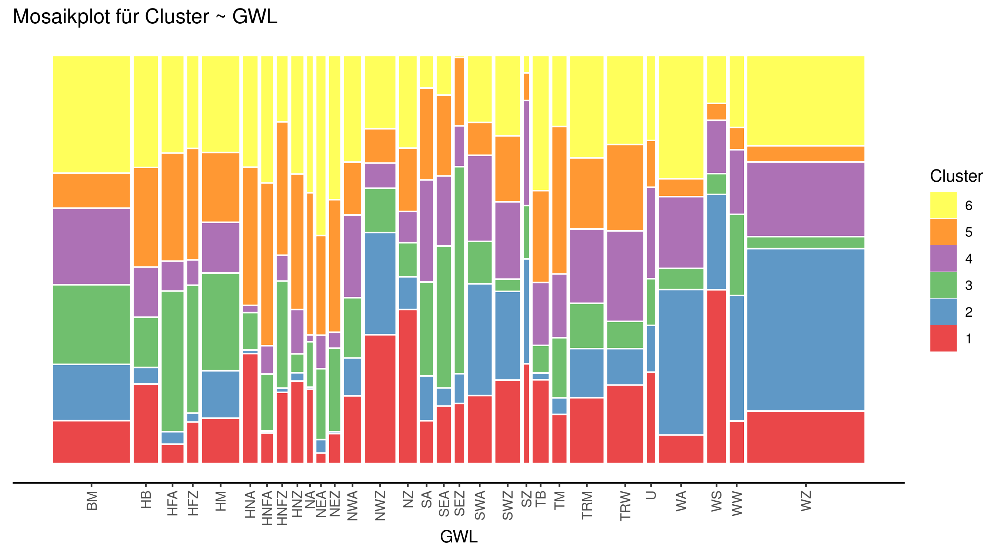
```

# Diskussion und Ausblick

## Saison

-wie sind GWL&Saison kombos in den Clustern verteilt?

-Saisonen einzeln geclustered ergebnisse


## CWL-Mindestlänge 3 Tage


\textcolor{red}{fringe change}

Abb.\ref{fig:mosaic_GWL_greater_2days} stellt die Aufteilung der GWLs auf die Cluster dar. Zudem wird gezeigt, wie häufig eine bestimmte GWL in den betrachteten Zeitraum von 1971 bis 2000 vorkommt. Im Gegensatz zu dem Mosaikplot aus Abb.\ref{fig:mosaic_GWL} sind hier nur Tage vertreten, bei denen drei aufeinanderfolgende Tage demselben Cluster zugeordnet sind. Während im Fall der ungefilterten Tage (weniger als drei aufeinanderfolgende Tage, die dem selben Cluster angehoren und nicht enfernt wurden) die vier GWLs HNFA,NA,NEZ und SEZ jeweils nur in fünf Clustern waren, waren bei den gefilterten Tagen (weniger als drei aufeinanderfolgende Tage, die dem selben Cluster angehoren und enfernt wurden) fünf GWLs, HNA,HNFA,HNFZ,NEZ und SEZ in nur fünf Cluster und die GWL NA in nur vier Cluster vertreten. Wie schon erwähnt sind bei den ungefilterten Tagen WZ und HNFA zu je 40% in Cluster 2, bzw Cluster 5, SEZ zu 52% in Cluster 3 und WS zu 43% in Cluster 1. Bei den gefilterten Tagen ist nun WZ statt 40% zu 43% in Cluster 2 und HNFA statt 40% zu 41% in Cluster 5 vertreten. SEZ befindet sich nun zu 58% in Cluster 3 statt zu 52%. Und Cluster WS ist zu 45% statt zu 43% in Cluster 1. Bei den gefilterten Tagen ist NA zu 40% in Cluster 5, bei den gefilterten Tagen befanden sich hingegen nur 34% in diesem Cluster. Letztendlich scheint das Herausfiltern von Tagen, bei denen weniger drei aufeinanderfolgende Tage demselben Cluster zugeordnet sind, zu einer leichten heterogeneren Aufteilung der GWLs auf die Cluster zu führen.
Eine Erklärung für diese nur leicht hererogenere Aufteilung ist, dass der relative Anteil der Tage, bei denen drei aufeinanderfolgende Tage demselben Cluster zugeordnet sind,  ur 12% aller Tage im Zeitraum von 1971 bis 2000 ausmacht.


```{r mosaic_GWL_greater_2days, echo = FALSE, fig.cap="\\label{fig:mosaic_GWL_greater_2days}Mosaikplot, der darstellt, mit welchem Anteil die GWLs auf die Cluster 1 bis 6 aufgeteilt sind. Hierbei sind nur Tage abgebildet, wo mindestens drei aufeinanderfolgende Tage dem selben Cluster zugeordnet sind", fig.align="center", out.width="100%"}
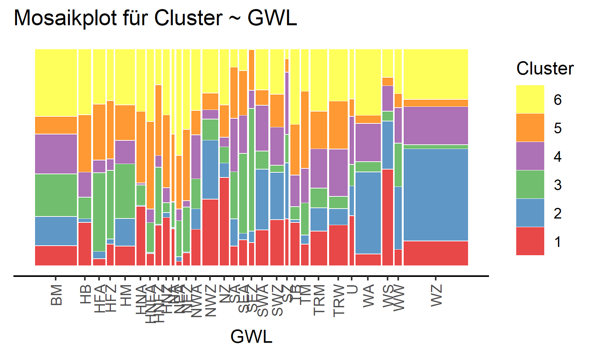
```

## GWL-Mindestlänge 4 Tage


Ein auffälliger Unterschied in der Art der Unterteilung der Tage zwischen den Großwetterlagen von Hess und Brezowsky und der angewendeten Clusteranalyse ist die Anforderung einer GWL mindestens 3 Tage lang zu sein. Man könnte naive vermuten, dass Tage einer bestimmten GWL zugeordnet werden, obwohl sie diese nicht deutlich verkörpern, um eine Länge von 3 Tagen zu erreichen, oder gar eine länger andauernde GWL nicht zu unterbrechen. Die geringe Anzahl der als *U* definierten Tage unterstützt diesen Gedankengang etwas. Folglich wird hier untersucht, wie die GWL, die länger als 3 Tage andauern, über die Cluster verteilt werden.


\textcolor{red}{insert Analysis of this}

## Erweiterung Variablen

**Temperatur** - Da der Reanalyse Datensatz bereits Informationen zur Temperatur an den Messpunkten eines Tages beinhaltet, könnte dieser Parameter recht einfach in das Modell als Variable aufgenommen werden oder auch nur als Ausprägung, mithilfe der die bereits vorliegenden Parameter bereinigt werden können.

 

**Strömungen** - In *GWL*-Beschreibungen tauchen häufig Ausprägungen von Strömungsrichtungen auf. Ein naiver Ansatz, dies zum Teil zu replizieren, ist, aus den gegebenen Daten eines Tages zum Mslp und Geopotential eine Art "Bewegung" zu bestimmen, indem zum Beispiel anhand der Veränderung des Standortes von dem maximal gemessenen Luftdruck über die 4 Messzeiten am Tag ein Vektor berechnet wird, mit dem Aussagen zur Bewegungsrichtung und -stärke des Hochdruckgebietes getroffen werden können.

## PAM & Filter

Die Methode, wie in Absatz [Filter Ansatz] beschrieben, weist in dessen Status Quo womöglich einen zu hohen Informationsverlust auf, um alleinig angewendet zu werden. Intuitiv lässt sich vermuten, dass ein Zusammenführen mit dem im Absatz [Clustern mit extrahierten Daten] beschriebenen Verfahren zu einer insgesammten Verbesserung führen könnte. Folgendes kann durch Addieren der Distanzmetriken vor dem Clustern auf Tagesebene erreicht werden.

\textcolor{red}{insert results of that and interpretation of it}

Grundsätzlich lässt sich aber auch anmerken, dass der Filter-Ansatz noch sehr unausgereift ist und durch Ausweitung zur Fähigkeit mehrere Gebiete zu erkennen oder ein grundsätzliches Optimieren des Algorithmus', z.B. der Abfallrate des Nachbarschaftsparameters *eps*, verbessert werden könnte.

Allerdings bleibt zu untersuchen, ob ein Convolutional Neural Network (*CNN*) wie in @CNN beschrieben, hierzu nicht allgemein geeigneter ist.

## Räumliche Struktur

Anhand der geringen Clusterbewertungskriterien des Filter-Ansatz' mit Geopotential (siehe [Filter Ergebnisse]) sowie den über die Cluster gemittelten Tagesbilder des Clusterns der extrahierten Daten mit PAM, bei dem sich die Bilder des Geopotentials räumlich sehr wenig unterscheiden (Abb. \ref{fig:geopot_measurepoints}), lässt sich die Vermutung aufstellen, dass die Ausprägungen des Geopotentials, zumindest so wie sie vorliegen, räumlich kaum Unterschiede aufweisen und somit sich zwischen Tagen keine verschiedenen Strukturen finden lassen (siehe Abb. \ref{fig:geopot_verID}). Auf der Basis ist es eventuell sinnvoller, nur die räumliche Komponente des Mslp beim Clusterverfahren zu betrachten oder zumindest diese höher zu gewichten. Etwas unterstützt wird dieser Gedanke davon, dass in den Beschreibungen der GWL nach Hess und Brezowsky häufig Bezug auf Ort und Form eines Druckgebietes am Boden genommen wird @sklima. Möglicherweise ließen sich auch deutlicher räumliche Strukturen in den Ausprägungen des Geopotentials finden, wenn diese im vorhinein räumlich bereinigt werden. Zum Beispiel unter der Annahme, dass im Norden immer geringere Messwerte erscheinen als im Süden.

```{r geopot_verID, echo = FALSE, fig.cap="\\label{fig:geopot_verID}Verteilung der vertikale Position der Geopotential Extrema von 1971-2000", fig.align="center", out.width="80%"}
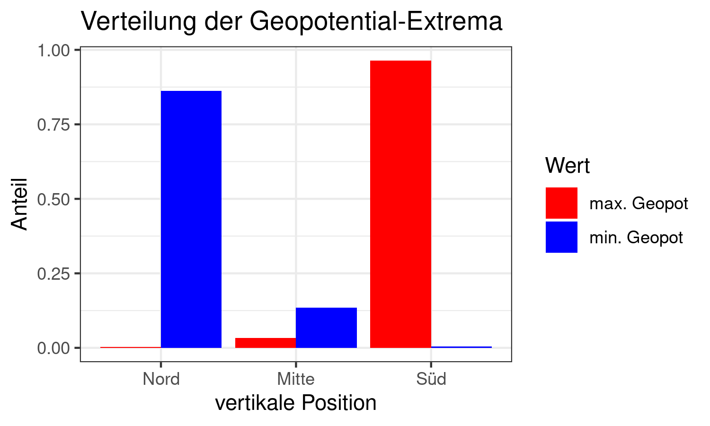
```

## Gewichtungsvektor

Grundsätzlich lässt sich feststellen, dass die Wahl des Gewichtungsvektors in der Clustermethode der extrahierten Daten (siehe Abschnitt [Clustern mit extrahierten Daten]) einflussreich gegenüber dem Clusterergebnis ist, bzw. das gezeigte Verfahren sensitiv gegenüber den Variablen-Gewichtungen ist. Dieser Vektor wurde, wie im Abschnitt [Gewichtung] beschrieben, in Absprache mit den Projektpartnern rein auf fachlich sinnvoller Ebene festgelegt.

Es lässt sich allerdings anzweifeln, ob so eine starre und ausgeglichene Gewichtungswahl zu dem besten Clusterergebnis führt. Wie schon im Abschnitt [Räumliche Struktur] angeschnitten, könnte die räumliche Komponente des Geopotentials heruntergewichtet werden. Eventuell sind bestimmte Gebiete auch relevanter als andere (z.B. der Raum über dem Festland Europa relevanter, als der über dem Atlantik), was unter anderem durch ungleiche Gewichte der Quadrantenmittelwerte dargestellt werden könnte.

Ein Ansatz die Gewichte der Variablen flexibler zu wählen ist, sie durch ein maschinelles Verfahren automatisch zu bestimmen. Zum Beispiel könnte eine Art komponentenweises Boosting durchgeführt werden, das iterativ das Gewicht einer Variable erhöht um einen bestimmten Wert zu optimieren.


$$
  W^{(t)} = argmax_{W_j, j = 1,...,k} \left( f\left(cluster(W_j^{(t-1)}X)\right)  \right)
$$ $$
  wobei: W_j^{(t-1)} = W^{(t-1)} + c_j
$$ $$
  X = \text{skalierter Datensatz , }  W = (w_1,...,w_k)^T = \text{Gewichtungsvektor}
$$ $$
  c = \text{Schrittweite , } f = \text{Bewertungsfunktion , } t = \text{Iterationsindex}
$$


Um die benötigte Rechenleistung zu reduzieren sowie auch zu verhindern, dass das Verfahren sich festläuft in dem z.B. immer dasselbe Gewicht erhöht wird, könnte eine Sampling-Strategie durchgeführt werden, sodass pro Iteration immer nur ein Teildatensatz geclustered wird. Ansatzweise werden hier 3 5-Jahres Perioden pro Iteration zufällig gewählt, die den Datensatz einer Iteration darstellen: $S = {s_1, s_2, s_3}$, wobei $s_i = \text{ein 5 Jahres-Datensatz}$ ist. Die zu optimierende Funktion könnte wie folgt zum Beispiel die Summe aus dem Durchschnitt des *Silhouettenwertes* der 3 Datensätze, dem Durchschnitt des *TLS* der 3 Datensätze und einem *Stabilitätswert* ($stab$) sein.


$$
 f(S) = avgSil(S) + avgTLS(S) + stab(S)
$$ $$
  avgSil(S) = \frac{1}{3} \sum_{i = 1}^3{sil(s_i)}
$$ $$
  avgTLS(S) = \frac{1}{3} \sum_{i = 1}^3{TLS(s_i)}
$$ $$
  stab(S) = 1-\left( \frac{1}{2} max_{i, j =1,2,3} \left(|sil(s_i) - sil(s_j)|\right) + \frac{1}{2}max_{i,j = 1,2,3}\left(|TLS(s_i) - TLS(s_j)|\right) \right)
$$ $$
 mit: sil = \text{Silhouettenkoeffizient}
$$ 

  Mit den in Abschnitt [Clustern mit extrahierten Daten] beschriebenen Variablen und dem beschriebenen Clusterverfahren erhält man duch oben genannter *Cluster-boosting* Methode nach \textcolor{red}{XX} Iterationen folgenden Gewichtsvektor \textcolor{red}{insert table of vector} sowie einen *Silhouettenkoeffizienten* von \textcolor{red}{XX} und einen *TLS* von \textcolor{red}{XX}. Außerdem lässt sich ein $HB_{diff}$ von \textcolor{red}{XX} beobachten.


## Zeitliche Struktur

Allgemein muss erkannt werden, dass jeglicher hier beschriebener Versuch Wetterlagen anhand einer Clusteranalyse der Tage einzuteilen, vernachlässigt, dass die Tage eine zeitliche Reihenfolge mit sich bringen. Anhand der Vorgabe, dass eine *GWL* nach dem Katalog von Hess und Brezowky mindestens 3 Tage lang sein muss, lässt sich vermuten, dass einzelnde Tage keine Wetterlage definieren können, sondern nur einen Teil davon bilden.

Eine Möglichkeit dies zu kombatieren liefert eventuell das Einbringen einer "3-Tage Regel" in das Clusterverfahren, die Tage nur einem bestimmten Cluster zuteilt, wenn in eine Richtung die folgenden zwei Tage ebenfalls diesem Cluster zugeteilt werden würden. Womöglich vorstellbar ist dies mit einem Verfahren wie (z.B.) *PAM*, dass seinen Medoid versetzt, wenn dadurch ein bestimmtes Gütekriterium verbessert wird, zumindest annähernd möglich. Das Gütekriterium könnte dann zum Beispiel zum Teil aus dem hier vorgestellten *TLS* bestehen.

 

Vorstellbar ist auch, dass eine Wetterlage nicht durch ein festes Muster, dem alle Tage innerhalb der Wetterlage ähneln, definiert werden kann, sondern dass eine Wetterlage ein fluides Konzept ist, dessen Anfangstage, Endtage und Tage dazwischen sich anders ausprägen. Somit wäre hier ein Methode benötigt, in der solches zeitlich abhängiges Ausprägungsmuster über mehrere Tage definiert werden kann.

Grundsätzlich lassen sich die Daten aber auch als Format eines Videos betrachten, da eine Abfolge von Bildern mit zeitlich vorgegebener Reihenfolge vorliegt. Vielleicht ist es im Allgemeinen sinnvoller, Abschnitte in diesem Video zu suchen, die anderen ähneln. Dafür müsste jedoch auf ein Modell ausgewichen werden, das ein solches Datenformat benutzen kann.

# Schluss

\textcolor{red}{???}

# Anmerkungen {.unlisted .unnumbered}

Reproduzierbarer Code und relevante Datein sind in einem Github Repository der Organisation \textcolor{red}{WeatherFrog} zu finden. Für Zugang, Kontakt zu den Autoren aufnehmen.

 

Wir, Katja Gutmair, Noah Hurmer, Stella Akouete und Anne Gritto, möchten uns herzlich bei M.Sc. Maximilian Weigert und M.Sc. Magdalena Mittermeier für die angenehme Zusammenarbeit und bei Prof. Dr. Helmut Küchenhoff für die Beratung bedanken. Außerdem bedanken wir uns bei B.Sc. Henri Funk für das Layout dieses Berichts.

\section{Referenzen}
