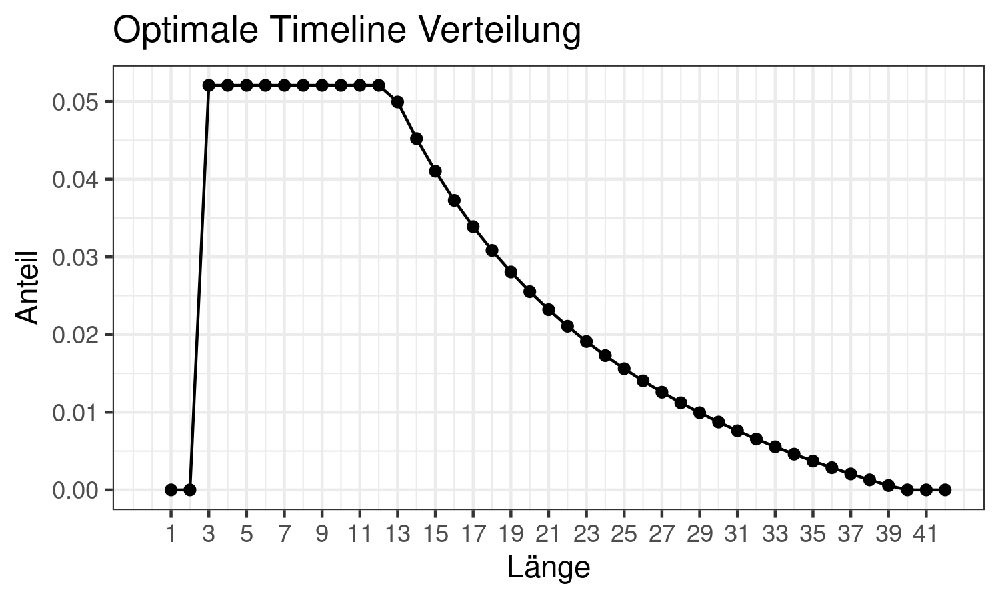

```{r setup, include=FALSE, warning=FALSE, message=FALSE}
knitr::opts_chunk$set(echo = TRUE)
library(tidyverse)
library(data.table)
library(checkmate)
library(knitr)
library(cluster)
library(kableExtra)
longrun = FALSE # set to TRUE to rerun all code
```


\newpage

\newcounter{savepage}
\pagenumbering{Roman}

\setcounter{tocdepth}{4}
\renewcommand{\contentsname}{Inhaltsverzeichnis}
\tableofcontents

\renewcommand{\listtablename}{Tabellenverzeichnis}
\listoftables

\newpage

\renewcommand{\listfigurename}{Abbildungsverzeichnis}
\listoffigures

\section*{Abkürzungen}


```{r Abkürzungen, echo=FALSE}
data.table(
  Ausdruck = c("Großwetterlage", "Clustering Large Applications", "Luftdruck in Pascal auf Meeresspiegelhöhe",
           "Geopotential auf 500 hPa in $m^2/s^2$", "Kovarianzmatrix", "Principle Component Analysis", "Partitioning Around Medoids", "Density-Based Spatial Clustering of Applications with Noise", "Ludwig-Maximilians-Universität", "Spatial Clustering around Points of Interest", "Cluster-Wetterlage (aufeinanderfolgende Tage mit demselben Clusterindiz)", "Timeline-Score"),
  Kurzform = c("GWL", "CLARA", "Mslp", "Geopotential", "$\\mathcal{C}$", "PCA", "PAM", "DBSCAN", "LMU", "SCAPOI", "CWL", "TLS")) %>%
  arrange(Ausdruck) %>%
  kable(booktabs = TRUE, format =  "latex", escape = FALSE) %>%
  kable_styling(latex_options = c("repeat_header", "striped"), full_width = TRUE)
```

\newpage

\setcounter{savepage}{\arabic{page}}

\pagenumbering{arabic} 

# Einleitung 
Die Fridays for Future Bewegung ist eine globale soziale Bewegung, die vor allem von Schülern und Studenten ausgeht. Diese gehen jeden Freitag auf die Straße und protestieren, um auf den Klimawandel und ihre Folgen aufmerksam zu machen.  
Es ist bekannt, dass der Klimawandel viele Veränderungen mit sich bringt.
Magdalena Mittermeier vom Department für Geografie und Maximilian Weigert vom Statistischen Institut der LMU untersuchen, wie sich das Auftreten verschiedener Großwetterlagen (GWL) unter dem Einfluss des Klimawandels verändert. 
Im Rahmen des Statistischen Praktikums unterstützen wir dieses Projekt, indem wir beobachtete Wetterdaten auf täglicher Basis in Cluster einteilen.

## Großwetterlagen
Es gibt zwei Kategorien, um die Großwetterlagen zu unterteilen, einmal die objektiven und subjektiven Großwetterlagen. 
Die uns zur Verfügung gestellte Einteilung in Großwetterlagen beruht auf subjektiven Einteilung, nach dem Katalog nach Hess und Brezowsky, der im Jahr 1952 veröffentlicht wurde. Es wurden 29 Großwetterlagen über Europa und dem Atlantik definiert. Zudem gibt es die Kategorie Unbestimmt (U), die angegeben wurde, wenn sich ein Tag keiner GWL zuordnen ließ (siehe @pik119). Die jeweiligen Tage lassen sich anhand von mehreren Variablen einteilen. Die Einteilung erfolgt nach den Zirkulationsformen in Bodennäheund in mittleren tropesphärischen Niveau. Die Zirkulationsformen sind zyklonal und antizyklonal 
Die Lage "West zyklonal" kommt am häufigsten vor. 

## Daten
Seit 1900 wird viermal täglich an 160 Standorten das Geopotential auf 500 hPa in $m^2/s^2$ und der Luftdruck (Mslp) in Pascal auf Meeresspiegelhöhe erhoben. Diese Variablen sind Teil des Reanalyse-Datensatzes ERA-20C, der für die Analysen zur Verfügungung steht. Außerdem ist uns die GWL für jeden Tag im Zeitraum von 1900 bis 2010 bekannt. Im Rahmen des Statistischen Praktikums wird mit dem Reanalyse-Datensatz geclustert.

\textcolor{red}{insert limitation to 30 years and average}


# Methodik


## Clusterbewertungskriterien

  Um den Erfolg einer Clusterlösung bewerten zu können und somit verschiedene Clusteransätze vergleichen zu können, mussten vorerst Bewertungskritereien fix etabliert werden. Hierbei soll zum einen beantwortet werden, ob grundsätzlich das Clustering erfolgreich ein Muster erkennt aber zugleich beachtet werden, ob dieses Muster gemäß der Daten auch sinnvoll ist. Repräsentierend für das erste Kriterium wurde der *Silhouettenkoeffizient* betrachtet, für letzteres die Verteilung der Anzahl von aufeinanderfolgenden Tage jeweils im selben Cluster; im Folgenden *Timeline* benannt.
  
  **Silhouettenkoeffizient**
   \textcolor{red}{insert here}
   
  **Timeline**  
  Da die zeitliche Struktur der Daten, sprich das Aufeinanderfolgen der Tage in spezifischer Reihenfolge bei der weiteren Analyse nicht mitbeachtet wird, lässt sich hiermit die Sinnhaftigkeit einer Clustereinteilung gut bewerten. Eine Aufteilung, bei der keine zeitliche Struktur erkennbar ist, beispielsweise ein konstanter Wechsel der Clusterzugehörigkeit in aufeinanderfolgenden Tagen, ist hier nicht als sinnvoll zu betrachten. Gleichermaßen unerwünscht ist jedoch eine Aufteilung die sehr lange Intervalle von Tagen gleicher Clusterzugehörigkeit aufweist. Die am längsten anhaltende GWL nach \textcolor{red}{Hess und Brezowski} in der hier zu untersuchenden Zeitperiode beträgt 23 Tage. Allgemein zeigen Großwetterlagen jedoch kürzere Längen auf.

```{r timeline_GWL, echo = FALSE, fig.cap="\\label{fig:timeline_GWL}Timeline der GWL 1971-2000", fig.align="center", out.width="80%"}

```
  
  Bei der Darstellung wie in Bild \ref{fig:timeline_GWL} ist die Anzahl jeweils mit der Länge multipliziert, sodass jeder Tag dasselbe Gewicht in der Darstellung besitzt. Die GWL, die hier nur eine Länge von 1 oder 2 Tagen aufweisen, sind jeweils als *U* (Undefiniert/Übergang) definiert. Es ist zu erkennen, dass die meisten Tage sich in Großwetterlagen der Längen zwischen 3 und 8 Tagen befinden, längere Großwetterlagen immer seltener werden und ab einer Länge von 15 Tagen nur noch einige wenige zu beobachten sind. 
  Anhand dieser Erkenntnisse werden nun Anforderungen an die Timeline der Clusterergebnisse gestellt. 
  
  Folglich sollen Cluster-Wetterlagen (folgend immer mit *CWL* abgekürzt) auch eine Mindestlänge von 3 Tagen besitzten, sprich Längen von 1 oder 2 Tagen sind bestenfalls nicht zu beobachten. Gleichermaßen sollen CWL nicht zu lang werden. Da in der Zeitperiode 1971-2000 die maximal beobachtete Länge 23 Tage beträgt, die Clusterzahl aber geringer als die Anzahl der GWL (29) sein soll, wird hier festgelegt, optimalerweise CWL nicht länger als \textcolor{red}{40 Tage} zu beobachten. Darüber hinaus sollen CWL eher mit den Längen 3 bis 12 Tagen auftreten. \textcolor{red}{Diese Optimierungsannahmen wurden hier allein in Bezug auf den Vergleich der GWL Timeline getroffen.}
  
  Um die Timeline einer Clusterlösung quantifizierbar und vergleichbar zu gestalten, wird über die Timeline eine Gewichtungsfunktion gelegt (siehe Bild \ref{fig:timeline_weights}). Der *Timeline-Score* (TLS) ergibt sich dann aus der Summe der Gewichteten Längen der CWL. Um den Definitionsbereich auf [0,1] zu beschränken, entspricht der *Timeline-Score* der Clusterlösung das Verhältnis zur Optimalen Timeline Verteilung.
  
```{r timeline_weights, echo = FALSE, fig.cap="\\label{fig:timeline_weights}Gewichte zum Quantifizieren der Timeline", fig.align="center", out.width="80%"}
include_graphics("assets/timeline_weights.png")
```
  
$$
  TLS = \frac{\sum_{i = 1}^{40}{w_i  x_i}}{\sum_{j = 1}^{n}{x_i w_{max}}}
$$
$$
  wobei: X = (x_1, ..., x_n) := \text{Anzahl Tage der jeweiligen CWL-Länge}
$$
$$
  W = (w_1, ..., w_{40}) := \text{Gewichtungsvektor}; w_{max} := max(W)
$$
  
  **ODER:**
  
  Um die Timeline einer Clusterlösung quantifizierbar und vergleichbar zu gestalten, wird der Timeline eine Verteilung unterlegt (siehe Bild \ref{fig:timeline_vtlg}). Der *Timeline-Score* (TLS) ergibt sich dann aus der Summe der punktweisen Abweichungen der Timeline der Clusterlösung zur optimalen Timeline Verteilung. Um den Definitionsbereich auf [0,1] zu beschränken, wird hier noch mit dem maximal möglichen Abstand normiert.
  
```{r timeline_vtlg, echo = FALSE, fig.cap="\\label{fig:timeline_vtlg}Erwünschte Verteilung der Timeline einer Clusterlösung", fig.align="center", out.width="80%"}

```

$$
  TLS = 1 - \frac{\sum_{l = 1}^{40}{|x_l - n_l w_l|}}{N}
$$
$$
  wobei: X = (x_1, ..., x_l) := \text{Anzahl Tage der jeweiligen CWL-Länge}
$$
$$
  N := \text{Anzahl Tage gesamt}
$$
$$
  W = (w_1, ..., w_{40}) := \text{Ausprägungen der optimalen Timeline Verteilung}
$$

## Clustern mit den Originaldaten
### Clara, Mahalanobis und PCA

### Filter Ansatz

#### Motivation

  Beim genaueren Blick in die Beschreibungen einzelner GWL ist zu erkennen, dass diese häufig duch Position oder Formation bestimmter Gebiete mit erkennbar höheren oder tieferen Messwerten definiert sind. \textcolor{red}{Beispiele?}

  Beispielsweise wird die GWL Trog Westeuropa (TRW) definiert durch ein sich vertikal erstreckendes Tiefdruckgebiet von Skandinavien bis zur Iberischen Halbinsel, flankiert von Hochdruckgebieten über dem Atlantik und Westrussland. Hingegen die GWL Hoch Britische Inseln (HB) ist, wie der Name bereits vermuten lässt, beschrieben durch ein Hochdruckgebiet über dem Vereinigten Königreich und Irland, umgeben von mehreren Tiefdruckgebieten @sklima. Ähnlich ist dies bei allen weiteren Großwetterlagen zu beobachten.
  
  Demnach lässt sich vermuten, dass die GWL sich anhand der Position und Form der an dem Tag respektiven Hoch- und Tief(druck)gebiete sinnvoll gruppieren \textcolor{red}{ließen}.
  
#### Prinzip Filtern
  
  Diesen Grundgedanken verfolgend, sind die Tage optimalerweise in interessierende Gebiete zu unterteilen und anhand dieser miteinander zu vergleichen. "Interessierende Gebiete" wurden hierbei vorerst angenommen als die Gebiete um die täglich gemessenen Extrema. Folglich also einem Gebiet höherer Messwerte um den am Tag maximal gemessenen Wert und einem Gebiet tieferer Messwerte um den minimalen Messwert. Dabei ist zu beachten, dass diese Gebiete nicht zu groß werden aber auch nicht nur aus einzelnen wenigen Punkten bestehen. Außerdem sollte ihre Form, unabhängig der Messwerte, nicht zum Beispiel immer einen Kreis darstellen. Beides führte später zu Problemen bei dem Vergleich zwischen den Tagen. Alle Standorte nicht in den interessanten Gebieten sollten beim Vergleich der Tage natürlich nicht mit einbezogen werden, demnach bei der Gebietseinteilung als Rauschen bezeichnet werden. Um diese Gebietseinteilung eines Tages durchzuführen, soll also ein metrischer Messwert eines bestimmten Standortes mit einer Gebietszugehörigkeit ersetzt werden. Die Messinformationen des Tagen sollen also "gefiltert" werden. Da sonst bestimmte Hyperparameter oder Grenzwerte fest angegeben werden müssten, lässt sich dies durch ein seperates Clusterverfahren über die 160 Standorte pro Tag erreichen. Mit der Idee anhand beider Parameter-Messwerte (Mslp und Geopotential) "Gebiete-Muster" zu erkennen und, da durch experimentieren herausgefunden wurde, dass die beiden Parameter vereinigt keine besonders sauberen Muster zu erkennen ließen, wird jeder Tag zwei mal auf diese Weise geclustered; jeweils pro Parameter ein Mal. Die Feature-Variablen dieses Clusterverfahrens sind demnach Longitude, Latitude und der Parametermesswert. 
  
#### DBSCAN und Fuzzy
  
  Um der Anforderung der nicht uniformen Gebiete gerecht zu werden, erscheint ein dichtebasiertes Clusterverfahren von Vorteil. Ein implementiertes Verfahren, das auch die Möglichkeit des Rauschens beinhaltet, ist *DBSCAN* (Density-Based Spatial Clustering of Applications with Noise). \textcolor{red}{DBSCAN erklären?}
*DBSCAN* benötigt keine Angabe der Clusteranzahl, sonder nur der Hyperparameter *minPoints* (minimale Anzahl an Punkte pro Cluster) und *eps* (Nachbarschaftsparameter). Hier lässt sich erhoffen, dass eventuell auch mehr als nur die zwei Gebiete um die Extrema erkannt werden. 
  Allerdings musste schnell erkannt werden, dass der Algorythmus mit diesen Daten sich sehr sensitiv gegenüber den Hyperparametern präsentiert, selbst wenn der Nachbarschaftsparameter pro Tag anhand dem Wert der grössten \textcolor{red}{Curviture eines kNN-Plots} spezifisch berechnet wird. \textcolor{red}{zeigen} Dies führt dazu, dass sehr viele Tage nur zu Noise, einem einzigen Cluster oder zu riesigen Clustern gefiltert werden; was natürlich widerrum nicht erwünscht ist, da die Vergleichbarkeit der Tage im Nachhinein damit nahezu unmöglich wird. \textcolor{red}{beispiel ergebnisse} Ein Bestimmen der Startpunkte und somit ein Festsetzen der Cluster-Orte ist - zumindest in vorhandenen Implementationen dieses Algorythmus' - nicht möglich. Deswegen lässt sich beobachten, dass die Extrema oft nicht in einem der eingeteilten Clustern befinden, da sie sich oft stark von durchschnittlichen Messwerten abweichen. Was man mit diesem Algorythmus somit erhält, ist im besten Fall ein Herausfinden von Gebieten, dessen Messwerte durchschnittlich sind und kaum Veränderungen aufweisen. Solche Gebiete sind aber hier as nicht von besonderem Interesse vermutet.

  Ein weiterer vielversprechender Ansatz ist das *Fuzzy*-Clustering \textcolor{red}{Fuzzy erklären?}, da hier Startpunkte angegeben werden können und anhand der Clusterzugehörigkeitswahrscheinlichkeit jeder Beobachtung, bestimmte Beobachttungen mithilfe eines Schwellenwertes im Nachhinein zu Rauschen verwandelt werden können. 
  
  Neben dem, dass *Fuzzy* üblicherweise rechentechnisch sehr teuer implementiert ist, kommt hinzu, dass dieses Verfahren natürlich auf ein Mittelpunkt pro Cluster beruht und die Distanz dazu anhand eines gegebenen Distanzmaß' bestimmt wird. Nachdem die Koordinaten als Variablen aufgenommen werden, führt dies zu Clustern gleicher Form und verletzt somit die Anforderung die Form eines Gebietes möglichst getreu darzustellen. \textcolor{red}{beispiel ergebnisse}

#### SCAPOI
 
  Im Folgenden wird der benutzte Algorithmus beschrieben, der eine abgeänderte Version des *DBSCAN* darstellt. Dieser beinhaltet fixe Startpunkte und ein iterierend strenger werdendes Nachbarschaftskriterium. Er wird im folgenden immer als *SCAPOI* (Spatial Clustering around Points of Interest) benannt. 

&nbsp;

 \begin{algorithm}[H]
 \KwData{Messwerte eines Parameters der 160 Standorte am Tag}
 \KwResult{Gebietszugehörigkeitsvektor pro Tag}
 \;
 eps0 = Berechnete Distanz des Punktes der größten Krümmung in Bezug auf kNN TODO\;
 Startpunkte = Orte des gemessenen Minimums und Maximums\;
 \For{jeden Startpunkt}{
    eps = eps0\;
    beginne ein Cluster um den Startpunkt\;
    \While{Neue Punkte gefunden werden, die hinzugefügt werden}{
    Prüfe ob es Punkte gibt, die < eps von einem im Cluster existierenden Punkt entfernt sind\;
    \eIf{ein Punkt bereits einem anderen Cluster angehört}{
     Füge es dem Cluster hinzu, dessen Startpunkt es am nächsten liegt\;
     }{
     füge es dem Cluster hinzu\;
    }
    eps = reduzierter eps\;
   }
 }
 nicht zugeteilte Punkte bleiben Noise\;
 \caption{SCAPOI - Algorythmus}
\end{algorithm}
  
&nbsp;
  
  
  Die Startpunkte werden hier jeweils als die Extrema der Messpunkte gewählt. Der Nachbarschaftsparameter *eps* muss groß genug gewählt (bzw. berechnet) werden, um zu berücksichtigen, dass die Extrema im Vergleich zu anderen Messwerten stark abweichen und somit zu verhinderen, dass die Cluster gar nicht oder zu gering wachsen. Allerdings führt aber zu großer eps dann zu einem unendlichen Wachsen der Cluster, da der Abstand eines Messpunktes zu seinem Nachbar quasi fast nie größer ist, als der Abstand der Extrema zu seinen Nachbarn. Deshalb wird dieser Nachbarschaftsparameter *eps* pro iteration verkleinert.

  Im Vergleich zu *DBSCAN*, mit dem Gruppierungen von Beobachtungen gesucht werden, die einer bestimmten mindest-Dichte, sowie einer mindest-Größe gerecht werden, wird mit *SCAPOI* versucht um bestimmte definierte Beobachtungen Gruppen zu bilden, die eine gewisse Dichte aufweisen. Im Fall hier (2 Cluster um min und max respektive), erhält man nun einen Gebietszugehörigkeitsvektormit den Klassen: Noise, High und Low.
 
#### Distanzmetrik

  Um nun wieder auf Tagesebene clustern zu können, sprich mit den Tagen als Beobachtungseinheit Cluster zu bilden, benötigt man eine Metrik, mit der diese Gebietszugehörigkeitsvektoren zweier Tage mieinander verglichen werden können. Der *Rand-Index* präsentiert eine solche Möglichkeit. Dieser vergleicht jeweils, ob pro Clusterlösung Paare zweier Beobachtungen jeweils im selben cluster liegen. Obwohl dies eher gedacht ist, um Lösungen verschiedener Clusterverfahren mit denselben Beobachtungen zu vergleichen, ist der *Rand-Index* hier möglich, da die Messpunkte konstant sind.
  Allerdings ist hier irrelevant, in welchem Cluster sich das Paar jeweils befindet. Was in diesem Fall nicht erwünscht ist: Zwei Tage mit identischen Gebietsformen und -orten aber gespiegelter Zugehörigkeit sollen nicht eine Distanz von 0 zueinander aufweisen. Zu dem sind natürlich Messpunkte, die als Noise definiert wurden, nicht von Interesse und sollten demnach auch nicht mit einbezogen werden.
  Folgend wurde eine Distanzmetrik definiert, die über beide Tage alle Messpunkte, die jeweils als Noise definiert wurden, nicht betrachtet und mit den verbleibenden jeweils nur vergleicht, welche Gebietszugehörigkeit die Messpunkte jeweils aufweisen.
  \textcolor{red}{insert Formula}
  
$$
d(A, B) = 1 - (\frac{\text{Anzahl Messpunkte mit gleichem Clusterindiz}}{\text{Anzahl Messpunkte gesamt}})
$$
$$
\text{wobei die Messpunkte in Noise jeweils nicht miteinbezogen werden}
$$

#### Ergebnisse


## Clustern mit extrahierten Daten
Ein weiterer Ansatz ist, dass Informationen aus dem Reanalyse Datensatz extrahiert werden und diese dann Variablen eines neuen Datensatzes werden. Diese Idee knüpft an den des vorher beschriebenen Ansatz des Filterns an. Auch hier ist die Lage von Extremwerten von Interesse. Zwar wird hier die Form der jeweiligen Tief- und Hochdruckgebiete vernachlässigt, aber es lassen sich weitere interessante Informationen mit hinzunehmen. 

Dabei versteht man unter interessanten Informationen unter anderem die Verteilung der Parameter Luftdruck und Geopotential sowie das Einbeziehen der räumlichen Ebene. Das bedeutet, der neue Datensatz beinhaltet zwei Kategorien, die Verteilung der Parameter, die bestimmte Messwerte pro Tag enthält und die räumliche Ebene, die diese dann örtlich einordnet.

Wir erhoffen uns von dieser Methodik, dass die Dimensionen weiter reduziert werden können und dass wichtige Größen spezifisch gewichtet werden können.

### Extrahieren der Variablen
Die Ausgangslage beim Extrahieren der Variablen ist dabei größtenteils der Datensatz mit 320 Dimensionen, also der, bei dem die vier Messzeitpunkte für jeden Tag gemittelt wurden. Davon extrahieren wir verschiedene Größen, die jeweils eine für uns interessante Variable über alle Standorte zusammengefasst verkörpert, wie zum Beispiel der Mittelwert des Luftdrucks über alle Standorte pro Tag. Dieser ist damit unabhängig von den Standorten und gehört zu der Kategorie "Verteilung der Parameter" am Tag. Weitere Variablen dieser Kategorie sind das Minimum und Maximum, der Median, die 0.25- und 0.75-Quantile, die Intensität und die Veränderung über den Tag jeweils für beide Parameter Luftdruck und Geopotential. 

Für das Minimum, Maximum, Median, Mittelwert und die beiden Quartile wird je ein Tag mit den 160 Standorten betrachtet, wovon diese Variablen für den Luftdruck sowie für das Geopotential extrahiert werden. 

Die Intensität wird in "Intensität Hoch" und "Intensität Tief" aufgeteilt und ist die Anzahl der Messwerte am Tag, die unter bzw. über dem 0.25- bzw. 0.75-Quantil, über alle Tage zusammen betrachtet, liegen. Sind beispielsweise an einem Tag 10 Messwerte des Geopotentials unterhalb des 0.25-Quantils über alle Tage betrachtet, so ist die Variable "Intensität Tief Geopotential" für diesen Tag 10. Die Intention dahinter ist, dadurch zum einen, die Größe von Hoch- und Tiefdruckgebiete am Tag zu bestimmen. Hochdruckgebiete sind hier einfachhalber durch hohen Luftdruck und hohes Geopotential definiert, wobei diese Parameter getrennt voneinander betrachtet werden und analog für ein Tiefdruckgebiet. 
\textcolor{red}{evtl bezug auf internetseite mit def hoch und tiefdruckgebbiet} Das bedeutet, insgesamt gibt es 4 Variablen, die die Intensität beschreiben - Intensität Hoch und Intensität Tief je für Mslp und Geopotential. Dadurch lassen sich die Tief- und Hochdruckgebiete am Tag miteinander vergleichen. Zum anderen kann die Größe und Intensität der Gebiete über alle Tage verglichen werden, da sie in Bezug auf die Quartile über alle Tage gebildet werden. So kann es zum Beispiel sein, dass an einem Tag die Intensität des Luftdrucks für ein Hochdruckgebiet 0 ist, da an diesem Tag generell niedrige Mslp Werte beobachtet wurden. 

In Abschnitt \textcolor{red}{wahrscheinlich 1...} wurde bereits beschrieben, dass der Mittelwert über vier Messzeitpunkte pro Tag gebildet wurde. Da dies mit einem Informationsverlust einhergeht, wird die Variable "Veränderung über den Tag" eingeführt. Sie ist definiert als die summierten, absoluten Differenzen des maximalen und minimalen Messwertes für jeden Standort am Tag. Diese Variable wird folglich mit Hilfe des Originaldatensatzes, ohne Informationsverlust, für beide Parameter Mslp und Luftdruck extrahiert. 

Da bereits Variablen extrahiert wurden, die die Verteilung der Parameter an verschiedenen Tagen beschreiben, ist jetzt noch die räumliche Ebene von Interesse. Dafür wird das 8x20 Grid in 9 Quadranten unterteilt, also in Nord - Süd, Ost - West und jeweils die Mitte bzw. das Zentrum, wie man in Bild \ref{fig:quadranten} sehen kann.

```{r quadranten, echo = FALSE, fig.cap="\\label{fig:quadranten}Aufteilung in 9 Quadranten", fig.align="center", out.width="80%"}
include_graphics("assets/quadranten.png")
```

Es wird jeden Tag angegeben, in welchem der 9 Quadranten sich die Extremwerte, also Minimum sowie Maximum für je Luftdruck und Geopotential, befinden. Ursprünglich waren diese Variablen kategorial, da die Quadranten von eins bis neun durch nummeriert wurden, z.B. 

$Quadrant_{maxMslp, i} \in \{1, 2, ... , 9\} \ mit \ i = 1, ... , 10958\ (Anzahl\ der\ Tage)$. Allerdings ist der Datensatz dadurch sowohl mit numerischen, als auch mit kategorialen Variablen und die Möglichkeiten zu clustern sind damit eingeschränkt. Deshalb wurden zwei "Dummy-Variablen" eingeführt, sodass die Lage auch numerisch angegeben werden kann. Diese Variablen sind Spalte und Zeile für die vier Extremwerte am Tag, beispielsweise $Zeile_{maxMslp, i} \in \{1, 2, 3\}\ und\\ Spalte_{maxMslp, i} \in \{1, 2, 3\}\  mit\ i = 1, ... , 10958$. \textcolor{red}{noch genauer erklären?}

Zudem werden die Distanzen zwischen Extrempunkten mit einbezogen. Zum einen die Distanzen zwischen dem Maximum und Minimum für je Geopotential und Luftdruck. Zum anderen die Distanzen vom Minimum bzw. Maximum des Geopotential zu den jeweiligen Extremwerten des Luftdrucks für jeden Tag. Alle Distanzen werden mit der euklidischen Distanz gebildet, wobei die Longituden und Latituden der Extremwerte am Tag zur Berechnung betrachtet werden. 

Zuletzt werden die Kategorien, Verteilung der Parameter und räumliche Ebene, vermischt, indem die Mittelwerte für beide Parameter in allen 9 Quadranten angegeben wird. Das sind somit 18 weitere Variablen.

Insgesamt umfasst der neu extrahierte Datensatz 48 Variablen. Die Variablen wurden in Absprache mit dem Projektpartner definiert und es lassen sich bestimmt auch noch weitere inhaltlich sinnvolle Variablen definieren. In Tabelle \ref{tab:variablen} sind die extrahierten Variablen für je das Geopotential sowie den Luftdruck zusammengefasst.

```{r variablen, echo=FALSE, fig.cap="\\label{tab:variablen}Extrahierte Variablen. Each row represents a list element"}
data.table(
  Variable = c("Minimum", "Maximum", "Mittelwert", "Median", "Quartile", "Intensität Hoch", "Intensität Tief", 
               "Veränderung über den Tag", "Spalte Minimum", "Zeile Minimum", "Spalte Maximum", "Zeile Maximum",
               "Distanz zwischen Extrema", "Distanz der beiden Minima", "Distanz der beiden Maxima", 
               "Mittelwerte in den Quadranten"),
  Definition = c("Minimaler Wert pro Tag", "Maximaler Wert pro Tag", "Mittelwert pro Tag", "Median pro Tag", 
                 "Quartile pro Tag", 
                 "Anzahl der Messpunkte am Tag, die über alle Daten über dem 0.75-Quantil liegen", 
                 "Anzahl der Messpunkte am Tag, die über alle Daten unter dem 0.25-Quantil liegen", 
                 "Summierte Differenzen von vier Messzeitpunkten am Tag für alle Standorte",
                 "Spalte x, in dem sich Minimum befindet; x = 1, 2, 3",
                 "Zeile y, in dem sich Minimum befindet; y = 1, 2, 3",
                 "Spalte x, in dem sich Maximum befindet; x = 1, 2, 3",
                 "Spalte y, in dem sich Maximum befindet; y = 1, 2, 3",
                 "Euklidische Distanz zwischen Minimum und Maximum",
                 "Euklidische Distanz vom Minimum Geopotential zu Minimum Mslp",
                 "Euklidische Distanz vom Maximum Geopotential zu Minimum Mslp",
                 "Mittelwerte in jeweils 9 Quadranten")) %>%
  kable(booktabs = TRUE, format =  "latex", escape = FALSE, label = "variablen", caption = "Extrahierte Variablen") %>%
  kable_styling(latex_options = "striped", full_width = TRUE)
```

### Distanzmetrik
Cluster können gefunden werden, indem die Distanzen von allen Beobachtungen in einem Datensatz miteinander verglichen werden. \textcolor{red}{finde Quelle}. Dafür muss ein Distanz- oder Ähnlichkeitsmaß festgelegt werden oder neu implementiert werden. Die Wahl für diese Clusteranalyse fiel auf die Manhattan-Distanz, die für zwei Beobachtungen *a* und *b* definiert ist als

$$
d(a, b) = \sum_{i = 1}^{p} |a_{i} - b_{i}|
$$
$$
wobei\ a = (a_{1}, ... , a_{p})\ und\ b = (b_{1}, ... , b_{p})\ mit\ p = 48\ (Anzahl\ der\ Variablen)
$$

#### Skalierung 
Die Variablen haben verschiedene Skalen. Werte des Luftdrucks liegen beispielsweise immer zwischen \textcolor{red}{99000 - 106000 (?)} und die des Geopotentials zwischen \textcolor{red}{50000 - 59000 (?)}.  Außerdem gibt es auch Variablen, wie zum Beispiel die Zeilen oder Spalten die nur Werte von eins, zwei oder drei aufweisen. Der Abstand von verschiedenen Variablen kann somit sehr groß sein und da zum Berechnen einer Distanzmatrix diese Werte betrachtet werden, muss der Datensatz vor dem Clustering skaliert werden. Die Skalierung erfolgt hier durch eine Standardisierung, d.h. $x_{i,neu} = \frac{x_{i} - mu_{i}}{sigma_{i}}\ mit\ i = 1, ... , 48$. Dabei wird für jede Beobachtung einer Variable i der Erwartungswert dieser Variablen abgezogen und schließlich durch die Standardabweichung der Variable dividiert. Dies wird für alle im Datensatz enthaltenen, also 48 Variablen durchgeführt. Nach der Skalierung sind die resultierenden Werte vergleichbar, da sie die gleichen Skalen haben \textcolor{red}{stimmt das?} und somit sind auch die Distanzen zwischen Beobachtungen vergleichbar.

#### Gewichtung
Des Weiteren soll der extrahierte Datensatz gewichtet werden. Das bedeutet, es wird fachlich entschieden, wie wichtig bestimmte Variablen sind. Da die Gewichtung Einfluss auf das Bilden einer Distanzmatrix hat, ...\textcolor{red}{Satz noch fertig schreiben!} 

Dafür werden die Variablen zuerst in verschiedene Kategorien aufgeteilt. Die Kategorien sollen alle insgesamt das gleiche Gewicht haben. Hier wurden 7 Kategorien gewählt: Die Verteilungsvariablen Minimum, Maximum und Mittelwert ergeben je eine Kategorie für das Geopotential und den Luftdruck. Die restlichen Verteilungsvariablen, Median, Quartile, Intensität und Veränderung über den Tag sind 2 weitere Kategorien. Die fünfte und sechste Kategorie setzen sich aus den räumlichen Variablen Zeile, Spalte, Distanzen zwischen Extrema zusammen und die Mittelwerte in den Quadranten bilden die letzten zwei. Die Kategorien summieren sich jeweils auf eins und die Variablen werden innerhalb einer Kategorie gleich gewichtet.  

Weitere Distanzmetriken, die ausprobiert wurden, sind unter anderem die Euklidische Distanz und die Gower Distanz, die aber beide zu schlechteren Ergebnissen, gemessen anhand der definierten Bewertungskriterien, geführt haben.

### Entscheidung des Clusterverfahrens


Dieser Abschnitt präsentiert die Ergebnisse der deskriptiven Analyse der finalen Clusterlösung. Hierbei wird in Abschnitt 3.1 betrachtet, wie die Cluster eins bis sechs über die Jahre 1971 bis 2010 verteilt sind. Zudem wird das Verhältnis von Sommer- und Wintertagen in den einzelnen Clustern betrachtet.  Abschnitt 3.2 befasst sich mit den Ähnlichkeiten und Unterschieden der extrahierten 49 Variablen in den Clustern. Abschließend wird in Abschnitt 3.3 die Clusterlösung mit der GWL Einteilung nach Hess und Brezowsky verglichen, also in welchem Ausmaß die GWLs über die Cluster verteilt sind.

## Verteilung der Cluster über die Zeit

Abb. \ref{fig:distribution_of_years_over_cluster} stellt dar, wie häufig jedes Cluster im Zeitraum 1971 bis 2000 vorkommt. 
Zu erkennen ist, dass sich ein Cluster nicht auf eine bestimmte Zeitperiode beschränkt, sondern über den gesamten Zeitraum erstreckt.
Die Cluster eins bis drei sind heterogen über den Zeitraum von 1971 bis 2000 verteilt. Beispielsweise beinhaltet das Jahr 1985 6% aller Tage, die Cluster 1 zugeordnet sind, das Jahr 1990 beinhaltet hingegen nur 2% aller Tage, die Cluster 1 zugeordnet sind. Damit verglichen sind Cluster vier bis sechs sehr gleichmäßig über alle Jahre verteilt. In Cluster 4 sticht das Jahr 2000 hervor. In diesem sind 6,3% aller Tage, die Cluster 4 zugeordnet sind, vertreten, während in allen anderen Jahren durchschnittlich je 3% aller Tage, die Cluster 4 zugeordnet sind, vertreten sind. Somit beinhaltet das Jahr 2000 ca. doppelt so viele Cluster 4-Tage verglichen mit den anderen Jahren. Von allen Clustern ist Cluster 6 am gleichmäßigsten über alle Jahre verteilt. 


```{r distribution_of_years_over_cluster, echo = FALSE, fig.cap="\\label{fig:distribution_of_years_over_cluste}Darstellung der Häufigkeit, wie viele Tage pro Jahr im Cluster 1 bis 6 enthalten sind", fig.align="center", out.width="80%"}
include_graphics("assets/distribution_of_years_over_cluster.png")
```

Temperaturen im Winter sind durchschnittlich niedriger als im Winter. Deshalb wurde angenommen, dass diese saisonalen Unterschiede eventuell sich in der Clusterlösung wieder spiegeln. 
Um saisonale Unterschiede und deren Verteilung in den Clustern zu betrachten, wurde ein Kalenderjahr in Winter- und Sommertage aufgeteilt. Alle Tage im Zeitraum 16. Oktober bis 15. April werden als Wintertage definiert, die restlichen Tage folglich als Sommertage. 
Der Mosaikplot in Abb. \ref{fig:mosaic_seasons} visualisiert die relativen Häufigkeiten der Winter- und Sommertage in jedem Cluster. 
Cluster 1 bis 3 enthält überwiegend Wintertage; in Cluster 1 sind 88% aller Tage Wintertage, in Cluster 2 99% und in Cluster 3 98% aller Tage Wintertage. In Cluster 4 bis 6 sind hingegen überwiegend Sommertage vertreten; in Cluster 4 sind 79% aller Tage Sommertage und in Cluster 5 83% aller Tage Sommertage. Ein Sonderfall ist Cluster 6, da dieses ausschließlich aus Sommertagen besteht. 

```{r mosaic_seasons, echo = FALSE, fig.cap="\\label{fig:mosaic_seasons}Vorkommen von Winter- und Sommertagen in jedem Cluster", fig.align="center", out.width="90%"}
include_graphics("assets/mosaik_seasons.png")
```

## Unterschiede und Ähnlichkeiten in den Clustern

Dieser Abschnitt befasst sich mit der Fragestellung, wie sich die Werte der 49 extrahierten Variablen, mit denen geclustert wurde, zwischen den Clustern unterscheiden. Dazu werden Mittelwerte, Standardabweichung und Verteilungen ausgewählter, repräsentativer Variablen betrachtet und 
dessen räumliche Verteilung über die 160 Messorte.

Abb. \ref{fig:observation_in_cluster} zeigt die Aufteilung der Tage im Zeitraum 1971 bis 2000 auf die Cluster 1 bis 6. Hierbei bildet Cluster 3 mit einer Anzahl an 1422 Tagen das kleinste Cluster. Cluster 6 beinhaltet die meisten Tage (2565 Tage). Während in Cluster 2 1952 Tage vertreten sind, beinhalten Cluster 1,4 und 5 eine ähnliche Anzahl an Tagen.

```{r observation_in_cluster, echo = FALSE, fig.cap="\\label{fig:observation_in_cluster}Verteilung der Tage im Zeitraum 1971 - 2000 auf die Cluster 1 bis 6", fig.align="center", out.width="80%"}
include_graphics("assets/number_of_observations_in_each_cluster.png")
```

Tabelle \ref{table:descriptive_cluster} bildet Mittelwert und Standardabweichung der Variablen mean.mslp, max, mslp, mean.geopot, max.geopt und min.geopot in jedem Cluster ab. Hierbei unterschieden sich die Werte einer Variablen in jedem Cluster nur gering voneinander. Zum Beispiel beträgt die maximale Abweichung der Variable mean.mslp über alle Cluster nur 8,2 hPa und die maximale Abweichung der Variable mean.geopot 287,7 gpm.

```{r descriptive_cluster, echo = FALSE, fig.cap="\\label{fig:descriptive_cluster}Mittelwert und Standardabweichung ausgewählter Variablen pro Cluster. Alle Werte sind in der Einheit hPa für die Variablen mslp und gpm für die Variablen geopot", fig.align="center", out.width="80%"}
include_graphics("assets/table_descripitive_cluster.png")
```

Abb. \ref{fig: mean_mslp_boxplot} und Abb. \ref{fig:mean_geopot_boxplot} bilden die Verteilung der Variablen mean.mslp und mean.geopot je Cluster ab. Verglichen mit der Variable mean.geopot unterschiedet sich der Median und die Verteilung von mean.mslp in jedem Cluster wenig. Hierbei beinhaltet Cluster 2 mit einem Median von 1009,5 hPa und einem Interquartilsabstand(IQR) von 3,8 hPa (1. Quartil = 1007,4  3.Quartil = 1011,2 hPa)  tendenziell die kleinsten Werte auf, während Cluster 5 mit einem Median von 1017 hPa und einem Interquartilsabstand von 3 hPa (1.Quartil = 1016 hPa, 3. Quartil = 1019 hPa) tendenziell die höchsten Werte aufweist. Zudem beinhaltet jedes Cluster mehrere Ausreiser. Ein Wert wird als Ausreiser definiert, wenn er außerhalb des Intervalls [median ±IQR] liegt.
Bei der Variable mean.geopot weisen die Werte der Cluster 4 bis 6 deutlich höhere Werte auf als die Werte in den Clustern 1 bis 3. Wie bei der Variable mean.mslp beinhaltet auch das Cluster 2 bei der Variable mean.geopot tendenziell die niedrigsten Werte mit einem Median von 5360 gpm und einem IQR von 58 gpm (1.Quartil = 5334 gpm, 3. Quartil = 5392 gpm). Cluster 6 weist tendenziell die höchsten Werte mit einem Median von 5654 gpm und einem IQR von 42 gpm (1.Quartil = 5632 gpm , 3. Quartil = 5674 gpm). Zudem weisen Cluster 2,3 und 6 Ausreiser auf.


```{r mean_mslp_boxplot, echo = FALSE, fig.cap="\\label{fig:mean_mslp_boxplot}Verteilung der Variable mean.mslp in jedem Cluster", fig.align="center", out.width="80%"}
include_graphics("assets/mean_mslp_boxplot.png")
```
```{r mean_geopot_boxplot, echo = FALSE, fig.cap="\\label{fig:mean_geopot_boxplot}Verteilung der Variable mean.geopot in jedem Cluster", fig.align="center", out.width="80%"}
include_graphics("assets/mean_geopot_boxplot.png")
```

Alle anderen extrahierten Variablen, die in die Clusteranalyse miteingegangen sind und die die Verteilung beschreiben, ähneln den beschriebenen Ergebnissen von mean.mslp und mean. geopot. Star, so dass mean. mslp und mean. geopot representativ für die übrigen Verteilungsvariablen stehen uns deshalb hier nicht erwähnt werden.


Nun wird betrachtet, wie sich der Mittelwert des Luftdrucks und  der Mittelwert des Geopotentials räumlich unterscheidet. Abb \ref{fig:mslp_measurepoints} bzw. Abb.\ref{fig:geopot_measurepoints} stellt pro  Cluster und für jeden der insgesamt 160 Standorte das arithmetrische Mittel der mslp bzw. geoppot Werte im Zeitraums 1971 – 2000 dar.
Blau Flächen visualisieren Gebiete mit niedrigen, rote Flächen visualisieren Gebiete mit hohen Werten. 

```{r mslp_measurepoints, echo = FALSE, fig.cap="\\label{fig:mslp_measurepoints}Räumliche Verteilung des gemittelten Luftdrucks über 30 Jahre an 160 Standorten je Cluster", fig.align="center", out.width="80%"}
include_graphics("assets/mslp_over_all_measurepoints.png")
````
```{r geopot_measurepoints, echo = FALSE, fig.cap="\\label{fig:geopot_measurepoints}Räumliche Verteilung des gemittelten Geopotentials über 30 Jahre an 160 Standorten je Cluster", fig.align="center", out.width="80%"}
include_graphics("assets/geopot_over_all_measurepoints.png")
````

Die räumliche Verteilung der gemittelten Werte des Luftdrucks ist pro Cluster unterschiedlich. In Cluster 1 befinden sich nordwestlich sehr hohe Werte während in Cluster 2 solch ähnlich hohe Werte des Luftdrucks im Süden zu finden sind. Zudem sind dort die hohen Werte über eine größere Fläche verteilt als in Cluster 1. In Cluster 3 ist hingegen das Gebiet mit hohen Luftdruckwerten östlich gelegen, in Cluster 4 und 6 südwestlich. Cluster 5 und 6  sind gekennzeichnet von tendenziell hohen Luftdruckwerten, ein ausgeprägtes Gebiet mit tiefen Luftdruckwerten ist in Cluster 5 nicht enthalten, und in Cluster 6 nur südöstlich. Im Gegensatz dazu befindet sich in Cluster 2 die größte Fläche mit niedrigen Luftdruckwerten, das nördlich gelegen ist. 
Insgesamt hat jedes Cluster eine eigene, charakteristische Verteilung der Luftdruckwerte.

Bei der räumlichen Verteilung der Werte des Geopotentials aufgeteilt nach Cluster ergibt sich hingegen ein anderes Bild im Vergleich zum Luftdruck. Tendenziell befinden sich in jedem Cluster  nördlich, bzw. nordwestlich niedrigere Werte ,  südlich, bzw. südwestlich sind höhere Werte. In den Clustern 1 bis 3 ist der Unterschied zwischen den niedrigsten und höchsten Werten des Geopotentials stärker ausgeprägt als in den Clustern 4 bis 6. 


## Vergleich der Clusterlösung mit den GWL

Der Mosaikplot in Abb.\ref{fig:mosaic_GWL} stellt die Aufteilung der GWLs auf die 6 Cluster dar. Zudem wird gezeigt, wie häufig eine bestimmte GWL in den betrachteten Zeitraum von 1971 bis 2000 vorkommt. Im Allgemeinen ist die Anzahl der auftretenden Wetterlagen heterogen. Hierbei ist die Großwetterlage WZ: Westlage zyklonal am häufigsten vertreten, dicht gefolgt von BM: Hochdruckbrücke Mitteleuropa. Selten vertreten sind die GWL NA: Nordlage antizyklonal, SZ: Südlage zyklonal und undefinierte Tage, also Tage, denen keine GWL zugeordnet werden kann. 
Jede GWL ist in allen Clustern vertreten; hierbei verteilen sich die GWLs gleichmäßig über die Cluster. Dennoch gibt es GWLs, die hauptsächlich in einem Cluster vorherrschen. WZ ist hauptsächlich in Cluster 2 vertreten SEZ hauptsächlich in Cluster 3 und WS hauptsächlich in Cluster 1.
Zudem wechseln in den meisten Fällen die GWLs und die Zugehörigkeit der Tage, die zu einem Cluster gehören, am selben Tag.

```{r mosaic_GWL, echo = FALSE, fig.cap="\\label{fig:mosaic_GWL}Mosaikplot, der darstellt, mit welchem Anteil die GWLs auf die Cluster 1 bis 6 aufgeteilt sind", fig.align="center", out.width="80%"}

````


##weitere ergebnis ansaetze

###pam + filter

# Schluss


\section{References}